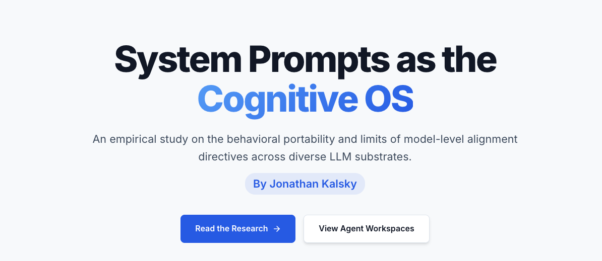
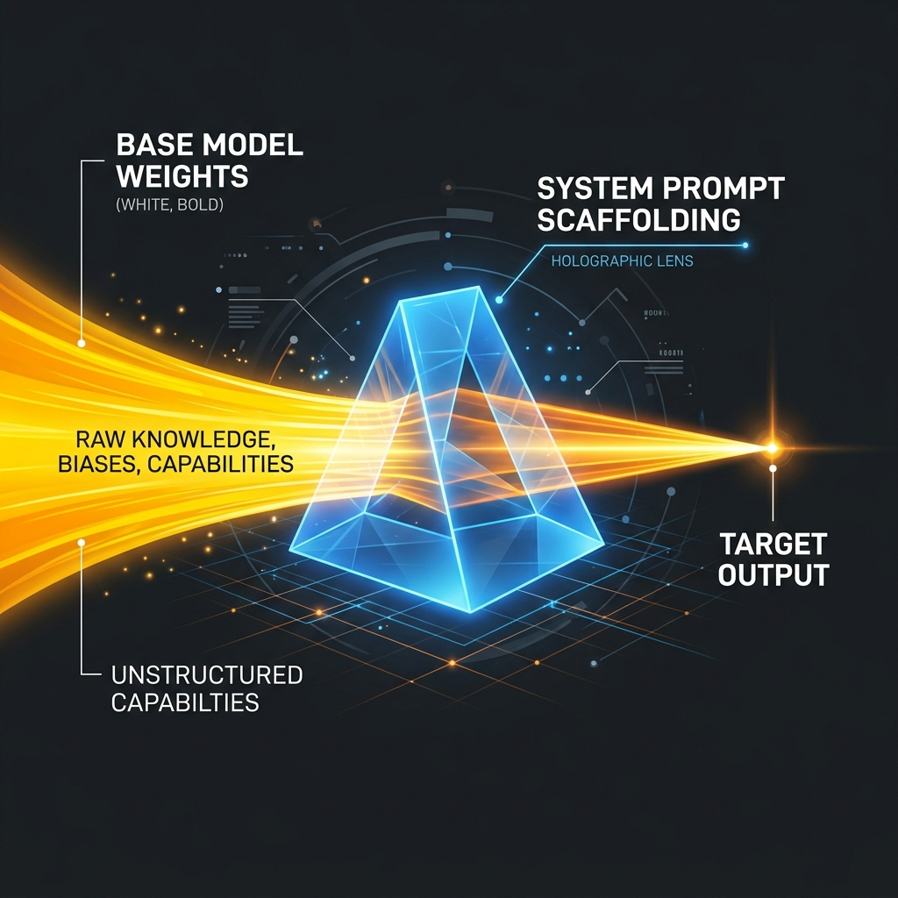

# Antigravity: System Prompts as a Behavioral Scaffolding and Routing Layer
An empirical study on the behavioral portability and limits of model-level alignment directives across different LLM architectures.

---

<table width="100%">
  <tr valign="top">
    <td width="50%" align="center">
      <strong>Research Walkthrough Website</strong><br /><br />
      
    </td>
    <td width="50%" align="center">
      <strong>System Prompt Scaffolding Concept</strong><br /><br />
      
    </td>
  </tr>
</table>

<div align="center">

## [Hosted Walkthrough Website](https://1j6k21.github.io/F4b13-5-4-Antigravity/)
</div>

## Author & Principal Architect
* **Jonathan Kalsky** (@1J6K21)

---

## Project Origin & Motive
While the world was praising the raw performance of newly released base models, I was focused on a more practical question: *how much of that behavior could actually be ported to strengthen my daily workload?* 

This inquiry drove this empirical study. We set out to evaluate whether system-level constitutions (behavioral rulesets) are portable across different model substrates, acting as a portable workflow layer that shapes reasoning format and decision priorities, while raw capabilities remain bound to the underlying base model weights.

---

## Key Findings & Observations
Our evaluations across multiple prompt setups and routing schemes yielded the following primary insights:
* **Style and Format Portability**: Tone directives and negative constraints (such as avoiding bulleted lists) transferred consistently across base model architectures (+5.11 adherence improvement).
* **Base Weight Convergence**: Injected strategic templates steered output layouts and vocabulary, but raw coding and execution capabilities remained bound to the underlying base model weights.
* **Monolithic Prompt Trade-offs**: Massive, single system prompts suffered from attention loss, context leakage (e.g., strategic directives leaking into syntax files), and prefill token bloat.
* **Cognitive Routing Scoping**: Splitting prompts into dynamic, targeted templates achieved a ~223x reduction in the system prompt component of the input payload, though overall runtime token overhead may be higher due to multi-turn routing steps.
* **Audit Role Separation**: Partitioning development tasks into isolated implementation (Coder) and audit (Systems Engineer) roles in a shared workspace led to higher bug resolution rates.

---

## Disclaimer: System Prompt Sources
The term "fable" used throughout the experimental variants in this repository refers to the system prompt instructions published officially by Anthropic in their [System Prompts Release Notes](https://platform.claude.com/docs/en/release-notes/system-prompts). This study explicitly investigates the behavioral portability and limits of these alignment directives when layered onto alternative LLM substrates.

---

## Repository Structure

* `reports/` — Scientific and experimental reports detailing the core findings.
  * `1_Executive_Summary.md` — Main overview of the experimental findings.
  * `2_Research_Findings_Report.md` — Deep dive into behavioral patterns and portability findings.
  * `3_Behavioral_Divergence_Report.md` — Analysis of substrate-dependent behavioral drift.
  * `4_Constitution_as_OS_Assessment.md` — Evaluation of the "Constitution-as-an-OS" paradigm.
  * `5_Failure_Analysis.md` — Breakdown of system failure modes, including context-compression degradation.
  * `6_Recommendations_for_Next_Experiments.md` — Directions for future research iterations.
  * `research_methodology_and_analysis.md` — Details on the proposed experimental setup vs. observed results.
* `phase_2/` — Phase 2 experimental design.
  * `Phase_2_Experimental_Design.md` — Framework for cognitive routing vs. monolithic scaffolding.
* `phase_3/` — Phase 3 experimental design.
  * `Phase_3_Experimental_Design.md` — Framework for coherent orchestration (collaboration squad vs. control).
* `presentations/` — HTML-based visual deliverables.
  * `community_presentation.html` — Slide deck for presenting research findings.
  * `research_recap_one_pager.html` — Interactive high-density summary page.
* `prompts/` — The raw constitutional files and benchmarking templates used.
* `scripts/` — Automated utilities for data extraction, chart formatting, and text polishing.
* `assets/` — Visual charts and empirical data plots.
* `experiment/` — The active experimental workspace.
  * `specs/` — Test requirements, procedures, and architectural proposals.
  * `scripts/` — Evaluation harnesses and batch-saving utilities.
  * `raw_data/` — Evaluation logs and raw quantitative scores.
  * `raw_outputs/` — Direct generated answers separated by tested LLM model.
  * Workspaces under evaluation:
    * `control_workspace/`
    * `fable_raw_workspace/`
    * `fable_compressed_workspace/`
    * `fable_innovations_workspace/`

---

## Limitations & Open Questions
To maintain scientific rigor and transparency, the following constraints should be noted regarding these experimental results:
* **Cognitive OS Status**: We did not prove that system prompts function as independent cognitive operating systems or that they are architectural primitives.
* **No Intelligence Boost**: System prompts guide *how* a model structures its reasoning and vocabulary, but they do not alter the base model's reasoning capabilities, IQ, or baseline intelligence.
* **Runtime Token/Cost Efficiency**: We did not measure overall runtime token costs, which may be higher due to classification routing and multi-agent loops.
* **Sample size limits**: The evaluation (n=20 benchmarks, n=1 application build) is exploratory. The sample sizes are too small to support generalized software engineering claims.
* **LLM-as-a-Judge**: Quantitative scoring relies on LLM-based evaluators, which carry inherent stylistic biases and may not perfectly correlate with human developer preferences.

---

## Citation & Reference
If you build upon this research, utilize the datasets, or reference the scaffolding and routing framing in your work, please cite:

```bibtex
@misc{kalsky2026antigravity,
  author       = {Jonathan Kalsky},
  title        = {Antigravity: System Prompts as a Behavioral Scaffolding and Routing Layer},
  year         = {2026},
  publisher    = {GitHub},
  journal      = {GitHub Repository},
  howpublished = {\url{https://github.com/1J6K21/F4b13-5-4-Antigravity}}
}
```

---

## Collaborations and Future Usages
We encourage the community to leverage and extend the Antigravity framework:
1. **Alternative LLM Substrate Benchmarking**: Test these constitutions against new model releases and submit behavioral convergence data.
2. **Context Compression Research**: Fork this repository to test the thresholds where high-density behavioral directives degrade due to long-context attention thinning.
3. **Agentic System Design**: Integrate these design patterns into your own production agent workflows to enforce strict behavioral consistency.
