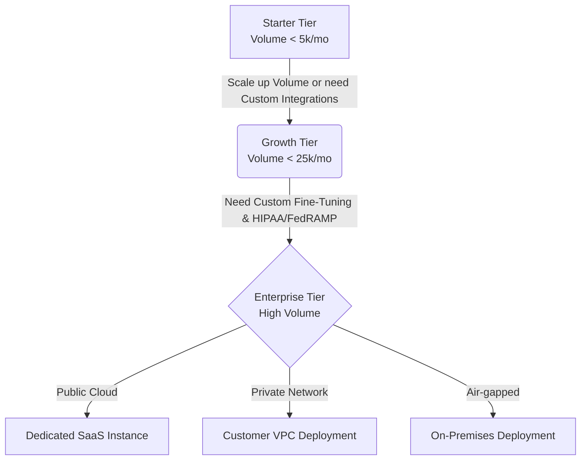

# DocuIntel AI: B2B SaaS Pricing & Feature Matrix

> [!TIP]
> **Product Vision**: DocuIntel AI is an enterprise-grade document intelligence platform that automates data extraction, classification, and analysis of unstructured documents (contracts, invoices, medical records) using state-of-the-art LLMs and custom OCR models.

## Pricing Tiers Overview

| Tier | Starter | Growth | Enterprise |
| :--- | :--- | :--- | :--- |
| **Target Profile** | Small teams, simple workflows | Mid-market, complex integrations | Large enterprises, strict compliance |
| **Base Platform Fee** | $499 / month | $1,499 / month | Custom (Starts at $7,500/mo) |
| **Included Volume** | 5,000 documents / mo | 25,000 documents / mo | 250,000+ documents / mo |
| **Overage Rate** | $0.15 per document | $0.08 per document | Custom (Typically $0.02 - $0.04) |

## Detailed Feature Matrix

### 1. Core AI & Processing Capabilities
| Feature | Starter | Growth | Enterprise |
| :--- | :--- | :--- | :--- |
| **Standard OCR & Text Extraction** | ✅ | ✅ | ✅ |
| **Handwriting & Cursive Recognition** | ❌ | ✅ | ✅ |
| **Generative AI Summarization** | ❌ | ✅ | ✅ |
| **Multi-Language Support** | 5 Languages | 40+ Languages | 120+ Languages |
| **Pre-trained Document Types** | Basic (Invoices, Receipts) | Advanced (Contracts, Tax Forms)| Unlimited (Any Document Type) |
| **Custom Model Fine-tuning** | ❌ | ❌ | ✅ (Dedicated Models) |
| **Confidence Score Thresholding** | ❌ | ✅ | ✅ |

### 2. Integration & Developer Experience
| Feature | Starter | Growth | Enterprise |
| :--- | :--- | :--- | :--- |
| **RESTful API Access** | Rate Limited (5 req/s) | Standard (50 req/s) | Unlimited (Custom SLAs) |
| **Webhooks for Async Processing** | ✅ | ✅ | ✅ |
| **Pre-built Connectors** | Zapier, Google Workspace | Salesforce, NetSuite, Workday | Custom ERP/CRM Connectors |
| **Custom Python/Node.js SDKs** | ✅ | ✅ | ✅ |
| **Sandboxed Testing Environment** | ❌ | ✅ | ✅ (Multiple Environments) |

### 3. Security, Compliance & Deployment
| Feature | Starter | Growth | Enterprise |
| :--- | :--- | :--- | :--- |
| **Data Retention Policy** | 30 Days (Auto-delete) | 1 Year | Configurable / Indefinite |
| **Automated PII Redaction** | ❌ | ✅ | ✅ |
| **Single Sign-On (SSO / SAML)** | ❌ | ✅ | ✅ |
| **Role-Based Access Control (RBAC)**| Basic | Advanced | Custom Granular Roles |
| **Compliance Certifications** | SOC 2 Type I | SOC 2 Type II, GDPR | HIPAA, FedRAMP, PCI-DSS |
| **Deployment Model** | Multi-tenant Public Cloud | Multi-tenant Public Cloud | Single-tenant VPC or On-Premises|

### 4. Support & SLAs
| Feature | Starter | Growth | Enterprise |
| :--- | :--- | :--- | :--- |
| **Customer Support Channels** | Email Only | Priority Email & Live Chat | 24/7 Phone, Slack/Teams Channel |
| **Response Time SLA** | 48 Business Hours | 4 Business Hours | 1 Hour (Critical Issues) |
| **Platform Uptime Guarantee** | Best Effort | 99.9% Uptime | 99.99% Uptime (Financially Backed)|
| **Dedicated Success Manager** | ❌ | ❌ | ✅ |
| **Guided Implementation** | Self-Service Docs | 2 Onboarding Sessions | Fully Managed Implementation |

## System Architecture & Upgrade Path

