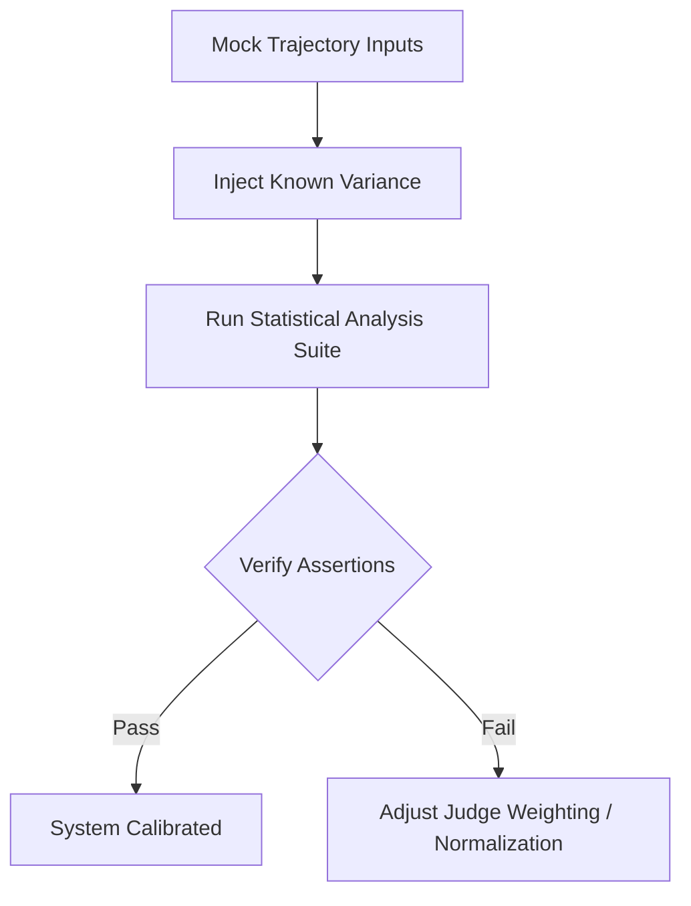

# Stage 1 Product Ideation & Design: EmpiricalBench (Controlled Benchmarking Platform for LLM Workflows)

EmpiricalBench is a high-precision, controlled benchmarking platform designed to measure, analyze, and verify the behavioral outcomes of multi-turn LLM agent workflows. By isolating system constitutions from execution capabilities, the platform provides reproducible statistical metrics for agent performance and alignment.

---

## 1. Scientific & Product Ideation Framework

### 1.1 Baseline Consensus vs. Opposing Views

| Perspective | Baseline Consensus | Opposing / Contrarian View (EmpiricalBench Approach) |
| :--- | :--- | :--- |
| **Evaluation Paradigm** | LLMs should be evaluated via static test sets (e.g., MMLU, GSM8K) or single-turn prompts graded by an "LLM-as-a-Judge." | Static benchmarks fail to capture behavior in multi-turn, stateful agentic workflows. Evaluation must assess *trajectories*, state transition matrices, and tool-interaction sequences. |
| **Statistical Model** | Evaluations yield deterministic scalar accuracy scores; a higher average score indicates a superior system. | LLMs are stochastic systems. Performance must be framed as a probability distribution with 95% confidence intervals, calculating statistical significance (p-values) for performance improvements. |
| **Variables Isolation** | Prompt modifications, capability enhancements (e.g., adding tools), and model versions can be evaluated together. | Variables must be strictly isolated. To determine if system prompt rules act as independent primitives, capabilities (tool access, context window, model substrate) must remain perfectly static. |

### 1.2 Explicit Assumptions
1. **Model Stationarity**: We assume the underlying LLM provider APIs remain behaviorally stationary during a benchmark run. Closed-source updates (e.g., silent GPT-4o optimization) are external noise that must be measured and controlled via baseline runs.
2. **Deterministic Capability Emulation**: We assume that tools (e.g., database clients, mock shells) can be modeled deterministically through sandboxed environments or deterministic mocks.
3. **Judge Consistency**: We assume that LLM-as-a-Judge evaluators exhibit systemic but quantifiable bias that can be normalized using statistical tests like Fleiss' Kappa or Cronbach's Alpha.

### 1.3 Known Unknowns
- **Dynamic Context Length Effects**: The degradation of agent adherence to system constitutions as context window length increases (due to multi-turn history accumulation) is a non-linear variable.
- **Judge Latent Bias**: The exact degree to which the choice of model for the evaluator (e.g., GPT-4o vs. Claude 3.5 Sonnet) biases the scores toward similar-styled completions is not fully mapped.

### 1.4 Falsifiable Hypotheses
*   **Hypothesis $H_{constitution}$**: System-level constitutions modify the entropy of agent tool-selection paths by more than 35% compared to baseline configurations, holding capability parameters and model substrate static.
    *   *Falsification Condition*: If the Jaccard distance between the set of tools executed by the "Systems Engineer OS" and the "Founder OS" under identical inputs is $< 0.10$, the hypothesis is rejected.
*   **Hypothesis $H_{drift}$**: At a temperature parameter $T > 0.0$, a minimum of 30 workflow runs is required to bound the variance of the alignment score to within $\pm 5\%$ at a 95% confidence level.
    *   *Falsification Condition*: If a 15-run sample yields a confidence interval narrower than $\pm 5\%$ under $T = 0.7$, the sample size assumption is falsified.

---

## 2. Core Features (MVP Scope)

1. **Constitutional Sandbox & Trajectory Runner**: 
   - Executes multi-turn workflow graphs under strict environment locks.
   - Injectable system configurations (system prompts, temperature, constraints) while freezing tool and API capabilities.
2. **Double-Blind Evaluation Orchestrator**: 
   - Anonymizes trajectory outputs (removing prompt branding or operational traces) and distributes them to multiple LLM judges.
   - Rotates evaluator models to detect and normalize judge bias.
3. **Statistical Integrity Dashboard**:
   - Computes:
     - **Divergence Index ($D_i$)**: Quantification of behavioral variance between configurations.
     - **95% Confidence Intervals (CI)**: Plotted over score distributions.
     - **P-values (Student's t-test or Mann-Whitney U test)**: Verifying if prompt optimizations yield statistically significant improvements.
     - **Cronbach’s Alpha ($\alpha$) / Fleiss' Kappa**: Measuring evaluator consensus.
4. **Trajectory Recorder & Diff Tool**:
   - Records state-transition graphs (nodes = LLM thoughts, edges = tool calls).
   - Generates diffs of agent trajectories side-by-side to pinpoint exactly where decision-making diverged.

---

## 3. Minimal Viable Scope (Out of Scope for MVP)

To maintain focus on core empirical verification:
- **Zero Real-Time Streaming Evaluation**: Data is processed in batch jobs post-execution to prevent network jitter from corrupting telemetry.
- **No Direct Automated Prompt Optimization (Auto-Tuning)**: The MVP isolates and measures variations but does not automatically rewrite prompts (omitting active RLHF loops).
- **Static Network Mocks**: The sandbox relies on standardized mock endpoints (e.g., simulated S3/Slack integrations) rather than deploying complex virtual machines or live external integrations.

---

## 4. Empirical Validation Protocol

To validate the EmpiricalBench platform itself, we establish the following protocol:



### 4.1 System-Level Metrics to Track

| Metric | Formula / Definition | Target Threshold | Validation Strategy |
| :--- | :--- | :--- | :--- |
| **Evaluator Consensus ($\alpha$)** | Cronbach's Alpha on Judge Scores | $\alpha \ge 0.80$ | Run 5 distinct judges on 100 identical trajectories. |
| **Type I Error Rate ($\alpha_{error}$)** | False Positive rate of drift detection | $\le 5.0\%$ | Run two identical control groups ($A_1$ vs $A_2$) and assert no statistically significant difference ($p > 0.05$). |
| **Run-to-Run Variance ($S^2$)** | Variance in trajectory length under $T=0$ | $S^2 = 0$ | Execute 50 runs of a deterministic workflow and verify identical state graphs. |

### 4.2 Unit Test Assertions (Mock Examples)

1. **Assertion on Static Isolation**:
   ```python
   def test_capability_lock():
       # Assert that adding or removing prompt tokens does not modify the execution capability signature.
       runner = TrajectoryRunner(config=sys_eng_config)
       assert runner.available_tools == baseline_tools
       assert runner.model_substrate == "gpt-4o-mini"
   ```
2. **Assertion on Statistical Significance**:
   ```python
   def test_significance_calculator():
       # Assert that the analyzer correctly rejects the null hypothesis when mean scores differ significantly.
       group_a = [0.9, 0.85, 0.88, 0.92, 0.87] # Mean: 0.884
       group_b = [0.4, 0.45, 0.42, 0.38, 0.41] # Mean: 0.412
       p_value = calculate_p_value(group_a, group_b)
       assert p_value < 0.01
   ```

### 4.3 Uncertainty Quantification

Evaluation scores contain inherent uncertainty due to:
- **LLM Judge Non-Determinism**: At $T=0.2$, judges display a standard deviation of $\sigma \approx 0.04$ on a 1-5 Likert scale. We quantify this by running bootstrapping resamples ($N=1000$) to construct error bars around the mean.
- **API Response Fluctuations**: Intermittent rate-limiting or network latency spikes ($\sigma \approx 120ms$) can lead to workflow failures that mimic agent hesitation. Telemetry records latency *minus* API wait times to isolate processing duration.
