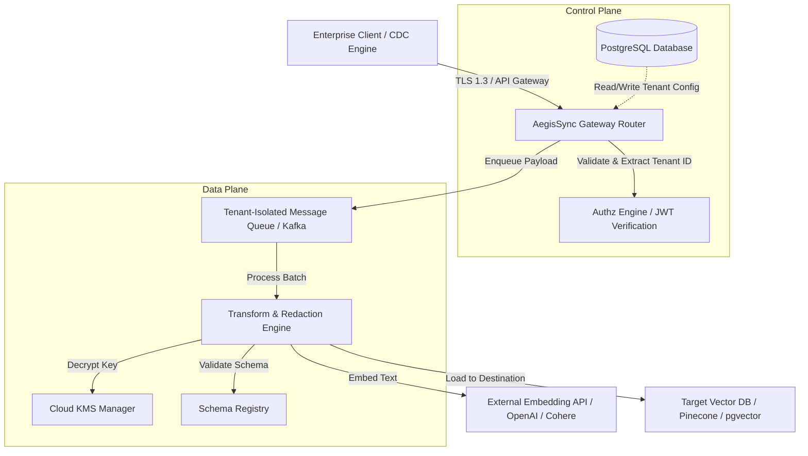

# Stage 2 System Architecture Blueprint: AegisSync
## Database Schemas, API Contracts & Error Recovery Models

This document outlines the concrete architectural specifications for AegisSync, detailing the database schema design, API definitions, data contracts, and error recovery policies required to implement a robust, secure multi-tenant sync gateway.

---

## 1. Architectural Topology



---

## 2. Database Schema (PostgreSQL)

To prevent tenant data cross-contamination and ensure strict isolation, we employ PostgreSQL Row-Level Security (RLS). Below is the SQL Schema DDL.

```sql
-- Enable necessary extensions
CREATE EXTENSION IF NOT EXISTS "uuid-ossp";
CREATE EXTENSION IF NOT EXISTS "pgcrypto";

-- Set up Tenant Table
CREATE TABLE tenants (
    tenant_id UUID PRIMARY KEY DEFAULT uuid_generate_v4(),
    name VARCHAR(255) NOT NULL,
    status VARCHAR(50) NOT NULL DEFAULT 'active' CHECK (status IN ('active', 'suspended', 'deactivated')),
    created_at TIMESTAMPTZ NOT NULL DEFAULT NOW(),
    updated_at TIMESTAMPTZ NOT NULL DEFAULT NOW()
);

-- KMS Key Configuration
CREATE TABLE tenant_kms_configs (
    config_id UUID PRIMARY KEY DEFAULT uuid_generate_v4(),
    tenant_id UUID NOT NULL REFERENCES tenants(tenant_id) ON DELETE CASCADE,
    kms_provider VARCHAR(50) NOT NULL CHECK (kms_provider IN ('aws_kms', 'gcp_kms', 'hashicorp_vault')),
    kms_key_arn VARCHAR(512) NOT NULL,
    kms_role_arn VARCHAR(512), -- IAM Role assumed to access KMS
    created_at TIMESTAMPTZ NOT NULL DEFAULT NOW(),
    updated_at TIMESTAMPTZ NOT NULL DEFAULT NOW(),
    UNIQUE(tenant_id, kms_provider)
);

-- Ingestion Source Adapters
CREATE TABLE ingestion_sources (
    source_id UUID PRIMARY KEY DEFAULT uuid_generate_v4(),
    tenant_id UUID NOT NULL REFERENCES tenants(tenant_id) ON DELETE CASCADE,
    name VARCHAR(255) NOT NULL,
    source_type VARCHAR(50) NOT NULL CHECK (source_type IN ('postgres_cdc', 'mysql_cdc', 's3', 'webhook')),
    connection_credentials BYTEA NOT NULL, -- Encrypted credential payload
    created_at TIMESTAMPTZ NOT NULL DEFAULT NOW(),
    updated_at TIMESTAMPTZ NOT NULL DEFAULT NOW()
);

-- Sync Targets (Vector Databases)
CREATE TABLE sync_targets (
    target_id UUID PRIMARY KEY DEFAULT uuid_generate_v4(),
    tenant_id UUID NOT NULL REFERENCES tenants(tenant_id) ON DELETE CASCADE,
    name VARCHAR(255) NOT NULL,
    target_type VARCHAR(50) NOT NULL CHECK (target_type IN ('pinecone', 'qdrant', 'milvus', 'pgvector')),
    target_endpoint VARCHAR(512) NOT NULL,
    target_api_key BYTEA NOT NULL, -- Encrypted target API Key
    dimension INTEGER NOT NULL CHECK (dimension > 0),
    created_at TIMESTAMPTZ NOT NULL DEFAULT NOW(),
    updated_at TIMESTAMPTZ NOT NULL DEFAULT NOW()
);

-- Sync Pipelines (Glue between Ingestion and Target)
CREATE TABLE sync_pipelines (
    pipeline_id UUID PRIMARY KEY DEFAULT uuid_generate_v4(),
    tenant_id UUID NOT NULL REFERENCES tenants(tenant_id) ON DELETE CASCADE,
    source_id UUID NOT NULL REFERENCES ingestion_sources(source_id) ON DELETE RESTRICT,
    target_id UUID NOT NULL REFERENCES sync_targets(target_id) ON DELETE RESTRICT,
    name VARCHAR(255) NOT NULL,
    transformation_rules JSONB NOT NULL DEFAULT '{}'::jsonb, -- Declarative schema mapping rules
    redaction_policy JSONB NOT NULL DEFAULT '{}'::jsonb, -- Masking/redaction configuration rules
    status VARCHAR(50) NOT NULL DEFAULT 'active' CHECK (status IN ('active', 'paused', 'error')),
    created_at TIMESTAMPTZ NOT NULL DEFAULT NOW(),
    updated_at TIMESTAMPTZ NOT NULL DEFAULT NOW()
);

-- Execution Audit Logs (WORM / Internal replication)
CREATE TABLE sync_job_logs (
    log_id UUID PRIMARY KEY DEFAULT uuid_generate_v4(),
    tenant_id UUID NOT NULL REFERENCES tenants(tenant_id) ON DELETE CASCADE,
    pipeline_id UUID NOT NULL REFERENCES sync_pipelines(pipeline_id) ON DELETE CASCADE,
    records_processed INTEGER NOT NULL DEFAULT 0 CHECK (records_processed >= 0),
    records_failed INTEGER NOT NULL DEFAULT 0 CHECK (records_failed >= 0),
    status VARCHAR(50) NOT NULL CHECK (status IN ('success', 'partial_success', 'failed')),
    error_summary TEXT,
    started_at TIMESTAMPTZ NOT NULL,
    completed_at TIMESTAMPTZ NOT NULL DEFAULT NOW()
);

-- Indexing for Query Optimization & Separation
CREATE INDEX idx_kms_tenant ON tenant_kms_configs(tenant_id);
CREATE INDEX idx_sources_tenant ON ingestion_sources(tenant_id);
CREATE INDEX idx_targets_tenant ON sync_targets(tenant_id);
CREATE INDEX idx_pipelines_tenant ON sync_pipelines(tenant_id);
CREATE INDEX idx_job_logs_tenant ON sync_job_logs(tenant_id);

-- Enable RLS on all tables
ALTER TABLE tenants ENABLE ROW LEVEL SECURITY;
ALTER TABLE tenant_kms_configs ENABLE ROW LEVEL SECURITY;
ALTER TABLE ingestion_sources ENABLE ROW LEVEL SECURITY;
ALTER TABLE sync_targets ENABLE ROW LEVEL SECURITY;
ALTER TABLE sync_pipelines ENABLE ROW LEVEL SECURITY;
ALTER TABLE sync_job_logs ENABLE ROW LEVEL SECURITY;

-- Dynamic Policies using app.current_tenant session variable
CREATE POLICY tenant_isolation_tenants ON tenants
    USING (tenant_id = NULLIF(current_setting('app.current_tenant', true), '')::uuid);

CREATE POLICY tenant_isolation_kms ON tenant_kms_configs
    USING (tenant_id = NULLIF(current_setting('app.current_tenant', true), '')::uuid);

CREATE POLICY tenant_isolation_sources ON ingestion_sources
    USING (tenant_id = NULLIF(current_setting('app.current_tenant', true), '')::uuid);

CREATE POLICY tenant_isolation_targets ON sync_targets
    USING (tenant_id = NULLIF(current_setting('app.current_tenant', true), '')::uuid);

CREATE POLICY tenant_isolation_pipelines ON sync_pipelines
    USING (tenant_id = NULLIF(current_setting('app.current_tenant', true), '')::uuid);

CREATE POLICY tenant_isolation_job_logs ON sync_job_logs
    USING (tenant_id = NULLIF(current_setting('app.current_tenant', true), '')::uuid);
```

---

## 3. API Contracts (JSON Schema / OpenAPI Specs)

All management interfaces accept and return strict JSON models. Below is the API Schema contract for creating/updating a pipeline definition.

### 3.1. API Path: `POST /api/v1/pipelines`
Configure a ingestion-to-vector database pipeline.

#### JSON Validation Schema:
```json
{
  "$schema": "http://json-schema.org/draft-07/schema#",
  "title": "CreatePipelineRequest",
  "type": "object",
  "properties": {
    "name": {
      "type": "string",
      "minLength": 3,
      "maxLength": 100,
      "pattern": "^[a-zA-Z0-9_-]+$"
    },
    "source_id": {
      "type": "string",
      "format": "uuid"
    },
    "target_id": {
      "type": "string",
      "format": "uuid"
    },
    "transformation_rules": {
      "type": "object",
      "properties": {
        "text_fields": {
          "type": "array",
          "items": { "type": "string" },
          "minItems": 1
        },
        "metadata_fields": {
          "type": "array",
          "items": { "type": "string" }
        }
      },
      "required": ["text_fields"]
    },
    "redaction_policy": {
      "type": "object",
      "properties": {
        "detect_pii": { "type": "boolean" },
        "mask_character": { "type": "string", "maxLength": 1 },
        "categories": {
          "type": "array",
          "items": {
            "type": "string",
            "enum": ["SSN", "EMAIL", "CREDIT_CARD", "PHONE_NUMBER", "IP_ADDRESS"]
          }
        }
      },
      "required": ["detect_pii"]
    }
  },
  "required": ["name", "source_id", "target_id", "transformation_rules", "redaction_policy"],
  "additionalProperties": false
}
```

---

## 4. Ingestion Data Contract (Data Plane)

When raw content is streamed via webhooks or CDC processors, the payload must conform to this schema:

```json
{
  "$schema": "http://json-schema.org/draft-07/schema#",
  "title": "IngestedPayloadEvent",
  "type": "object",
  "properties": {
    "event_id": { "type": "string", "format": "uuid" },
    "source_timestamp": { "type": "string", "format": "date-time" },
    "document_id": { "type": "string", "maxLength": 256 },
    "action": { "type": "string", "enum": ["upsert", "delete"] },
    "payload": {
      "type": "object",
      "properties": {
        "content": { "type": "string" },
        "metadata": { "type": "object" }
      },
      "required": ["content"]
    }
  },
  "required": ["event_id", "source_timestamp", "document_id", "action", "payload"],
  "additionalProperties": false
}
```

---

## 5. Error Recovery & Fault Tolerance Architecture

To avoid data loss or state drift during high load, external failures, or network partitioning, AegisSync implements a decoupled event-driven recovery flow.

```
       [ Ingestion Stream ]
                |
                v
        [ Ingestion Router ] --(Parse Check Failure)--> [ DLQ: Format Failure ]
                |
                | (Enqueue Successful Payload)
                v
      [ Kafka Ingestion Topic ]
                |
                v
      [ Transformer & Embedder ] --(Embedding Call Fails)--> [ Target Retry Queue ]
                |                                                 |
                |                                                 v
                |                                      [ Linear Backoff Retries ]
                |                                                 |
                v                                           (Max Retries Exceeded)
      [ Target Vector Writer ]                                    |
                |                                                 v
                +--(Vector DB Rate Limit / Timeout)---------> [ DLQ: Target Failure ]
```

### 5.1. Dead Letter Queue (DLQ) Strategy
*   **Format Failure DLQ:** Messages failing JSON schema validation are moved immediately to this queue. They do not trigger consumer group lag and are retained for debugging.
*   **Target Failure DLQ:** Messages which successfully validate but fail to load to the embedding provider or vector database (after max retry exhaustion) are serialized and pushed to a persistent disk-backed DLQ topic.

### 5.2. Retry & Circuit Breaker Configurations
*   **Exponential Jitter Retry Policy:**
    *   Initial backoff: `100ms`
    *   Backoff factor: `2.0`
    *   Jitter fraction: `0.5` (random noise added to delay)
    *   Maximum retry attempts: `5`
*   **Circuit Breaker Protocol:**
    If the downstream embedding provider or vector database triggers errors on > 15% of requests over a rolling 10-second window, the circuit breaker trips `OPEN`. Active pipeline sync tasks pause state consumption and emit alerts. A recovery routine sends periodic test probes; once target health is stable for 30 seconds, the breaker drops to `CLOSED` and the streaming consumers resume execution.
