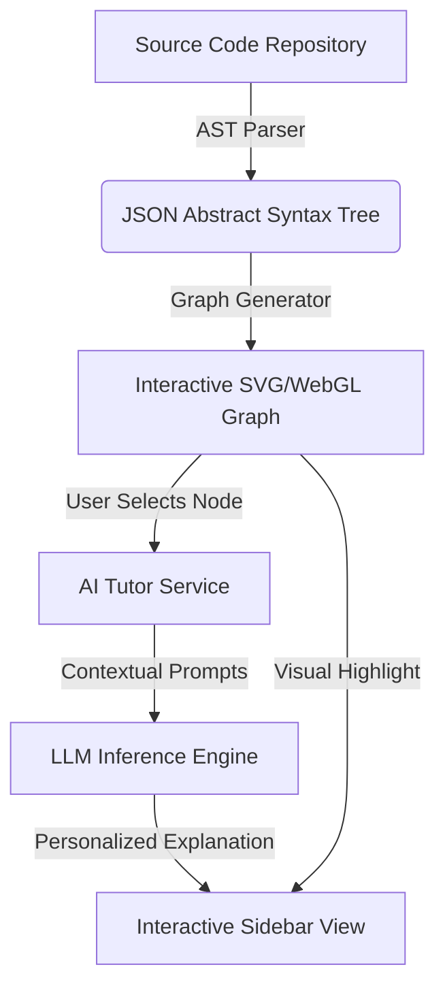

# CodexNavigator AI: Visual Codebase Learnability Platform
## Stage 1: Product Ideation & Design Scope

---

### 1. Conceptual Introduction & Analogies

#### The Onboarding Dilemma: The Tokyo Analogy
Imagine landing in Tokyo for the first time. You are given a dictionary containing every Japanese word, but you are not given a map, a GPS, or a guide. If you want to find a restaurant, you must walk door-to-door, translating every sign word-by-word. 

This is what onboarding onto a new, complex codebase feels like to a junior developer or a student. The codebase has thousands of files (the dictionary), but no visual map showing how they relate or how data flows between them. Developers are forced to read code line-by-line, trying to build a mental map of execution flow in their heads.

```
Traditional Code Reading:
[File A] -> (Imports?) -> [File B] -> (Calls?) -> [File C] (Mental overload!)

CodexNavigator AI:
   [Controller] ──(routes request)──> [Service Layer] ──(reads/writes)──> [Database]
         │                                    │
         └──> (Validates with Helper)         └──> (Logs with Logger)
```

#### What is CodexNavigator AI?
**CodexNavigator AI** is a **Visual Codebase Learnability Platform**. It bridges the gap between text-based code and conceptual understanding. By parsing source code, it generates an interactive, graphical representation of the system’s architecture. Combined with an LLM-powered educational agent, it acts as a conversational GPS for codebases, answering questions like:
* *"If I change this function, what breaks?"*
* *"Explain the database interaction flow as if I am five."*
* *"Where is the entry point for user authentication?"*

---

### 2. Product Vision & Target Audience

#### The Core Problem
Codebases grow organically and quickly exceed a single developer's mental capacity. System documentation is notoriously out of date. Consequently:
* **Time-to-productivity** for new engineers averages 3 to 6 months.
* **CS students** struggle to transition from small single-file homework scripts to large-scale open-source projects.
* **Architecture reviews** are done blind, leading to unintentional circular dependencies and leaky abstractions.

#### The Solution
CodexNavigator AI parses a repository's code to map classes, interfaces, and function calls. It visualizes these relations in a responsive network graph and layers an AI Tutor on top. Users can click any node (module) or edge (dependency) to receive an automated, educational breakdown of its role in the system.

#### Target User Personas
1. **The New-Hire Developer (Enterprise Onboarding)**: Needs to quickly comprehend the team's domain boundaries and service flows without constantly interrupting senior engineers.
2. **The CS Student / Self-Taught Learner**: Seeks to understand how professional software design patterns (e.g., Dependency Injection, MVC, Repository Pattern) work in production codebases.
3. **The Tech Lead / Architect**: Wants to audit codebase health, visualize architectural drift, and locate structural bottlenecks.

---

### 3. Core Features & Scope

#### Core Features
* **Interactive Architecture Graph**: A visual map (graph database-backed node-link layout) showing directories, files, functions, and their calls. Clicking nodes opens a code-viewer panel alongside explanations.
* **AI-Guided Walkthroughs (Code Walks)**: Users can select an API endpoint (e.g., `POST /auth/login`) and click "Walk Me Through." The platform highlights the execution path chronologically across files and databases, explaining each step.
* **Learnability Sandbox**: A playground where developers can write or edit a snippet of code, and the platform dynamically previews how the dependencies and architecture graph would morph in response.
* **Personalized AI Explanations**: A sidebar chat interface that reads the context of the currently selected node. Users can toggle the AI's explanation level between:
  * *New to programming (Analogies & high-level architecture)*
  * *Experienced developer (Design patterns, algorithmic complexity, performance traits)*



#### Scope & System Boundaries

##### In-Scope (Phase 1)
* Support for TypeScript/JavaScript and Python codebases.
* Repositories up to 5,000 files or 200,000 lines of code (LOC).
* Visualization of directory-to-file hierarchy and import/export dependencies.
* LLM-driven explanation of file-level responsibilities.

##### Out-of-Scope (Future Phases)
* Real-time production application performance monitoring (APM) trace integration.
* Support for legacy Compiled languages (e.g., C/C++, COBOL) in Phase 1.
* Direct code refactoring or auto-PR generation (the focus is purely on *learning* and *comprehension*).

---

### 4. Conceptual Checkpoint
Before proceeding to system design, verify the product alignment:
1. **Does this platform write or modify code?**
   * *Answer*: No. Its main focus is reading, visualizing, and explaining existing codebases to accelerate human comprehension.
2. **How does the system ensure the AI explanations are accurate and not hallucinated?**
   * *Answer*: The AI context is strictly bounded by the parsed AST (Abstract Syntax Tree) structures and direct file content. It does not guess the codebase architecture; it reads the structural relationships.

---

### 5. Educational Troubleshooting Guide

Here are common issues users face when conceptualizing or using CodexNavigator AI:

| Issue | Root Cause | Resolution |
| :--- | :--- | :--- |
| **"Spaghetti Graph" (Too many nodes/edges are overwhelming)** | Visualizing every single helper utility, standard library, and module import at once. | Apply filters to hide `node_modules` or library imports. Group nodes by directory level (aggregation) rather than showing individual function files by default. |
| **AST Parser fails on a modern syntax feature** | Parser configuration uses outdated ECMAScript or Python version standards. | Upgrade the parser dependency mapping to support the latest compiler options (e.g., `tsconfig.json` configurations for TypeScript). |
| **AI explanations do not match current code state** | The code was updated locally, but the database AST has not been synchronized/re-parsed. | Trigger a webhook or manual sync to update the abstract syntax tree repository records. |
