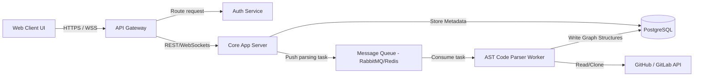

# CodexNavigator AI: Visual Codebase Learnability Platform
## Stage 2: System Architecture Blueprint

---

### 1. Conceptual Database & System Design

#### Analogy: Relational (Filing Cabinets) vs. Graph (Public Transit Maps)
When storing data, we must choose a model that fits our query patterns. 
* **Relational Database (SQL)**: Imagine a filing cabinet of folders. One drawer contains "User Info," another has "Repositories," and another has "Files." To find out which file imports which other file, you have to pull a folder, search for a document code, match it with a index sheet, and then open another drawer. In database terms, this is a **JOIN operation**. If you have to trace an execution path 10 steps deep, you must perform 10 JOIN operations, which is computationally expensive.
* **Graph Database**: Imagine a subway map. Every station is a "Node" (a file or function), and every track is an "Edge" (a dependency or function call). If you want to travel from Station A to Station E, you simply follow the tracks directly. No search indices are needed at each hop. 

For **CodexNavigator AI**, we use a hybrid design:
1. **Relational Database (PostgreSQL)** for user accounts, billing, settings, and job tracking where exact integrity and tabular structure are needed.
2. **Graph Model (represented as Node and Edge tables)** to model AST linkages, allowing fast, recursive path traversals using recursive common table expressions (CTEs) or specialized graph queries.

---

### 2. High-Level Architecture Topology



---

### 3. Database Schema Blueprint (PostgreSQL DDL)

Here is the annotated relational schema designed to store structural codebase networks:

```sql
-- Disable foreign key checks momentarily for clean script execution
SET statement_timeout = 0;
SET lock_timeout = 0;

-- 1. Users Table
-- Rationale: Tracks administrative and student users.
CREATE TABLE users (
    id UUID PRIMARY KEY DEFAULT gen_random_uuid(),
    email VARCHAR(255) UNIQUE NOT NULL,
    password_hash VARCHAR(255) NOT NULL,
    created_at TIMESTAMP WITH TIME ZONE DEFAULT CURRENT_TIMESTAMP,
    updated_at TIMESTAMP WITH TIME ZONE DEFAULT CURRENT_TIMESTAMP
);
CREATE INDEX idx_users_email ON users(email);

-- 2. Repositories Table
-- Rationale: Stores repositories linked to users or organizations.
CREATE TABLE repositories (
    id UUID PRIMARY KEY DEFAULT gen_random_uuid(),
    owner_id UUID NOT NULL REFERENCES users(id) ON DELETE CASCADE,
    name VARCHAR(255) NOT NULL,
    clone_url TEXT NOT NULL, -- Remote git address (e.g., https://github.com/org/repo.git)
    default_branch VARCHAR(100) DEFAULT 'main',
    last_synced_at TIMESTAMP WITH TIME ZONE,
    created_at TIMESTAMP WITH TIME ZONE DEFAULT CURRENT_TIMESTAMP,
    CONSTRAINT unique_owner_repo_name UNIQUE (owner_id, name)
);

-- 3. AST Nodes (Entities) Table
-- Rationale: Represents files, classes, interfaces, methods, or functions.
-- Using inheritance/type discriminator to handle node hierarchy.
CREATE TABLE ast_nodes (
    id UUID PRIMARY KEY DEFAULT gen_random_uuid(),
    repo_id UUID NOT NULL REFERENCES repositories(id) ON DELETE CASCADE,
    file_path TEXT NOT NULL,              -- Location in repo, e.g., 'src/auth/login.ts'
    node_name VARCHAR(255) NOT NULL,       -- E.g., 'LoginController' or 'validatePassword'
    node_type VARCHAR(50) NOT NULL,        -- 'FILE', 'CLASS', 'INTERFACE', 'FUNCTION', 'VARIABLE'
    start_line INTEGER NOT NULL,          -- Code highlighting boundary starts
    end_line INTEGER NOT NULL,            -- Code highlighting boundary ends
    raw_content TEXT,                     -- Slice of raw code (optional, or stored in blob storage)
    created_at TIMESTAMP WITH TIME ZONE DEFAULT CURRENT_TIMESTAMP
);

-- Indexing for visual mapping filters and lookup speed
CREATE INDEX idx_ast_nodes_repo_file ON ast_nodes(repo_id, file_path);
CREATE INDEX idx_ast_nodes_type ON ast_nodes(node_type);

-- 4. AST Edges (Relationships) Table
-- Rationale: Models code linkages (imports, calls, inheritance).
-- This acts as the adjacency list representing our graph.
CREATE TABLE ast_edges (
    id UUID PRIMARY KEY DEFAULT gen_random_uuid(),
    repo_id UUID NOT NULL REFERENCES repositories(id) ON DELETE CASCADE,
    source_node_id UUID NOT NULL REFERENCES ast_nodes(id) ON DELETE CASCADE,
    target_node_id UUID NOT NULL REFERENCES ast_nodes(id) ON DELETE CASCADE,
    relationship_type VARCHAR(50) NOT NULL, -- 'IMPORTS', 'CALLS', 'IMPLEMENTS', 'INHERITS'
    created_at TIMESTAMP WITH TIME ZONE DEFAULT CURRENT_TIMESTAMP,
    CONSTRAINT unique_edge UNIQUE (source_node_id, target_node_id, relationship_type)
);

-- Indexes to traverse graph forwards and backwards quickly
CREATE INDEX idx_edges_source ON ast_edges(source_node_id);
CREATE INDEX idx_edges_target ON ast_edges(target_node_id);
```

---

### 4. API Contracts (REST & WebSockets)

#### A. Trigger Repository Parsing & Sync (Asynchronous)
* **Endpoint**: `POST /api/v1/repositories/{repo_id}/sync`
* **Purpose**: Triggers the background worker to clone, run static AST parsing, and populate the Node/Edge database tables.
* **Request Header**: `Authorization: Bearer <jwt_token>`
* **Request Body**:
```json
{
  "branch": "main",
  "depth_limit": 50,
  "exclude_patterns": ["**/node_modules/**", "**/dist/**", "**/*.test.ts"]
}
```
* **Response (202 Accepted)**:
```json
{
  "job_id": "job_987654321_sync",
  "status": "QUEUED",
  "message": "Repository ingestion task has been queued for execution.",
  "estimated_time_seconds": 120
}
```

#### B. Fetch Visual Graph Data
* **Endpoint**: `GET /api/v1/repositories/{repo_id}/graph`
* **Purpose**: Retrieves filtered node-link structure data to render in the visual interface.
* **Parameters**:
  * `focus_node_id` (optional, UUID): Root path query focal point.
  * `max_depth` (optional, default 2): Number of dependency hops to fetch.
  * `node_type` (optional): Filter nodes to specific types (e.g. `FILE`).
* **Response (200 OK)**:
```json
{
  "nodes": [
    {
      "id": "node-1111-2222",
      "name": "login.ts",
      "type": "FILE",
      "path": "src/auth/login.ts"
    },
    {
      "id": "node-3333-4444",
      "name": "auth.service.ts",
      "type": "FILE",
      "path": "src/auth/auth.service.ts"
    }
  ],
  "edges": [
    {
      "id": "edge-5555-6666",
      "source": "node-1111-2222",
      "target": "node-3333-4444",
      "relationship": "IMPORTS"
    }
  ]
}
```

#### C. Educational Execution Walkthrough Tracing
* **Endpoint**: `GET /api/v1/repositories/{repo_id}/walk`
* **Purpose**: Traces execution sequence chronologically using sequential function call patterns.
* **Parameters**:
  * `entry_point_node_id` (required, UUID): E.g., The route handler function node.
* **Response (200 OK)**:
```json
{
  "entry_point": "node-1111-2222",
  "steps": [
    {
      "sequence": 1,
      "node_id": "node-1111-2222",
      "description": "API Gateway receives raw HTTP POST body.",
      "code_snippet": "router.post('/login', validateBody, AuthController.login);"
    },
    {
      "sequence": 2,
      "node_id": "node-3333-4444",
      "description": "Controller invokes verification service for credential analysis.",
      "code_snippet": "const user = await this.authService.verifyCredentials(email, password);"
    }
  ]
}
```

#### D. AI Chat Explanations Stream (WebSocket)
* **Connection URL**: `wss://api.codexnavigator.ai/v1/chat`
* **Flow**:
  1. Client sends user message with node ID context.
  2. Server responds with streamed chunks to simulate high-performance AI typing.

* **Client Message**:
```json
{
  "action": "ask_question",
  "context_node_id": "node-3333-4444",
  "user_query": "Explain what this service node does, and highlight any third-party APIs it talks to.",
  "complexity_preference": "BEGINNER"
}
```
* **Server Stream Chunk**:
```json
{
  "chunk_index": 42,
  "text_content": "This script handles verification. Analogy: Think of it like a bouncer checking IDs at a club door.",
  "is_complete": false
}
```

---

### 5. Conceptual Checkpoint
1. **Why does the graph fetch endpoint support a `max_depth` parameter?**
   * *Answer*: Visualizing 5,000 files simultaneously causes browser rendering crashes and extreme visual noise. Restricting the query depth filters the nodes to immediate neighbors of the user's focus, keeping visual performance snappy.
2. **How does the system associate source code lines with AST nodes?**
   * *Answer*: The AST Parser extracts `start_line` and `end_line` offsets during code analysis, linking each logical node to its line location in the SQL database records.

---

### 6. Architectural Troubleshooting Guide

| Issue | Potential Root Cause | Diagnostic Step | Mitigation |
| :--- | :--- | :--- | :--- |
| **Parsing processes take forever / Job timeouts** | Repository contains massive binary blobs or giant compressed data folders. | Verify parser logs. Look for large file sizes. | Add a `.codexignore` file parser configurations rule to skip analyzing big assets, binary files, or output builds. |
| **Visual rendering lags or crashes in Chrome** | SVG DOM tree is overloaded with 10,000+ graphic nodes. | Open Chrome DevTools Performance tab and check paint cycles. | Swap the front-end rendering engine from SVG elements to HTML Canvas or WebGL (e.g., using `pixi.js` or `sigma.js`) to offload painting calculations to the GPU. |
| **Recursive path CTE queries run out of shared memory** | Graph contains deep circular import loops that cause infinite query cycles. | Trace SQL execution path output. Analyze execution logs. | Configure the SQL CTE query block with a `LIMIT` or cycle detection condition (`CYCLE source_node_id SET is_cycle USING path`). |
