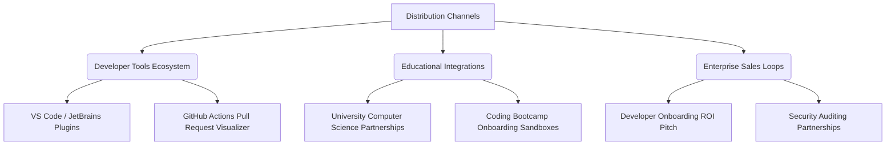

# CodexNavigator AI: Visual Codebase Learnability Platform
## Stage 4: Go-To-Market (GTM) & Pitch Strategy

---

### 1. Conceptual Introduction & Analogies

#### The Accessibility Analogy: The Public Library vs. The Exclusive Lounge
Traditionally, understanding a complex software architecture is like trying to enter an exclusive, invite-only lounge. The only way to get in is to be personally introduced by a member who already knows the secret handshake (i.e. having a senior developer spend hours walking you through the directories). 

**CodexNavigator AI** transforms software comprehension into a **Public Library with an AI Tour Guide**. Instead of gatekeeping, the platform makes any repository accessible to anyone who wants to learn, regardless of their network or baseline expertise.

Our Go-to-Market strategy is built on this democratization principle: **Learnability is not just a feature, it is a business multiplier**. If we can lower the barriers to code comprehension, we can dramatically reduce onboarding costs for companies and educational frustration for students.

---

### 2. Educational Access & Pricing Tiers

We divide access based on scale, codebase confidentiality, and collaborative education features.

```
┌────────────────────────────────────────────────────────────────────────┐
│                              ACCESS TIERS                              │
├───────────────────┬────────────────────────────┬───────────────────────┤
│    Free Tier      │       Pro Scholar          │  Enterprise Academy   │
│ (OSS & Students)  │   (Individual Devs)        │ (Orgs & Bootcamps)    │
│  $0 - Forever     │        $12 / mo            │  $49 / dev / mo       │
├───────────────────┼────────────────────────────┼───────────────────────┤
│ • Public Git repos│ • Private repos (up to 5)  │ • On-Prem / VPC deployment │
│ • Standard AI model│ • Advanced AI Tutor context│ • Team shared maps    │
│ • Community forums│ • Priority queue parsing   │ • Custom model tuning │
└───────────────────┴────────────────────────────┴───────────────────────┘
```

#### A. The Scholar & Open-Source Tier ($0 / Free)
* **Goal**: Fuel product adoption, support students, and build community goodwill.
* **Features**:
  * Free analysis of public GitHub/GitLab repositories.
  * Direct integration with the **GitHub Student Developer Pack**.
  * Access to standard code-visualization and baseline AI explanations.
  * *Why*: Students learn by reading open-source code. Giving them this tool turns them into power users who will demand CodexNavigator at their future workplaces.

#### B. The Pro Scholar Tier ($12 / Month)
* **Goal**: Support individual freelance developers, researchers, and professional engineers working on side projects.
* **Features**:
  * Analysis of up to 5 private repositories.
  * Advanced AI models with deep reasoning (better logic tracing and architectural synthesis).
  * Extended code walk memory limits.

#### C. The Enterprise Academy Tier ($49 / User / Month)
* **Goal**: Help organizations accelerate new-hire onboarding and eliminate documentation bottlenecks.
* **Features**:
  * On-Premise / VPC deployment options (guaranteeing code security and zero LLM data retention policy training leakage).
  * Custom fine-tuning of AI explanations based on the company's internal wiki documentation (Confluence, Notion, README files).
  * Visual impact analysis for pull requests (reviews changes and alerts devs about potential design pattern violations).

---

### 3. Distribution Channels



#### A. IDE Extension Stores (VS Code, JetBrains)
* **Strategy**: Meet developers where they work. 
* **Implementation**: We build a sidebar extension. When a developer highlights a complex function, the sidebar displays its place in the visual graph and explains the data flow without forcing them to change context or open a browser.

#### B. GitHub Actions Marketplace
* **Strategy**: Make visual maps a standard part of the code review lifecycle.
* **Implementation**: Our GitHub App automatically comments on Pull Requests with an SVG map showing only the lines of code that changed, and tracing the upstream/downstream impact of the modifications.

#### C. Higher Education & Bootcamp Partnerships
* **Strategy**: Integrate into the curriculum of Software Engineering courses.
* **Implementation**: Instructors can upload assignment repositories, creating pre-set walkthroughs to teach students MVC or Microservices concepts in active codebases.

---

### 4. Interactive Learning Modules (Syllabus Tracks)

Out of the box, CodexNavigator AI provides guided tracks where the platform uses the student's *own code* or selected open-source repos as the textbook.

#### Module Track 1: "Design Patterns in the Wild"
* **Concept**: Bridge academic theory with actual codebase production layouts.
* **Flow**:
  1. The platform automatically searches the codebase for common design patterns (e.g., Singleton, Factory, Strategy, Observer).
  2. It highlights the files using color-coded nodes on the map.
  3. The AI guides the user: *"Look at how the factory pattern creates class instances on line 45 of `factory.py`, and trace how it decouples our service module."*

#### Module Track 2: "Data Flow & The Network Lifecycle"
* **Concept**: Master execution paths in web architectures.
* **Flow**:
  1. Traces a client HTTP request from raw route routing definitions, down through service controllers, down through SQL transaction queries, and back up.
  2. The student interacts by toggling visual layers: Controller Layer, Database Layer, Middleware Layer.

#### Module Track 3: "Safe Refactoring & Impact Analysis"
* **Concept**: Learn to write code without breaking the system.
* **Flow**:
  1. The student edits a function in the sandbox.
  2. The graph dynamically turns affected downstream nodes red, showing the blast radius of the proposed code changes.

---

### 5. Conceptual Checkpoint
1. **Why do we prioritize the student free tier if it doesn't bring immediate revenue?**
   * *Answer*: It creates a "Bottom-up Developer Loop." Developers who learn systems using our interactive maps during university will naturally introduce CodexNavigator to their employers once they transition into corporate junior roles, bypassing long enterprise cold-outreach cycles.

---

### 6. Pitch & Rollout Troubleshooting Guide

| Objection / Issue | Target Audience | Pitch / Mitigation Strategy |
| :--- | :--- | :--- |
| **"We cannot send our proprietary code to external LLMs."** | Enterprise CTO / Chief Security Officer | Offer self-hosted deployments via Docker/K8s using local open-weight models (e.g., Llama-3 or Mistral) running on local hardware, ensuring no code leaves the firewall. |
| **"AI explanations will make students lazy (plagiarism concern)."** | University Professors / CS Instructors | Pitch the platform as a comprehension verification tool rather than code writer. Shift the grading style: ask students to record a 2-minute video explaining a visual execution path mapped by CodexNavigator. |
| **"Developers already have IDEs with Go To Definition; why pay?"** | Engineering Managers | Frame the value in onboarding velocity. Onboarding a junior engineer takes ~80 hours of senior-dev time. Reducing this by just 25% saves $3,000+ per hire, easily covering the license cost. |
