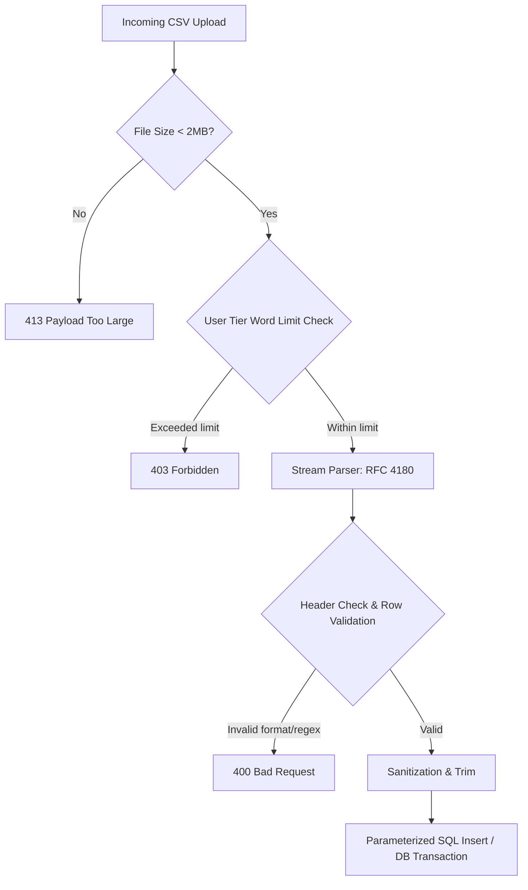

# HanziFlow — API Contracts & Security Design

This document details the interface contracts, boundary validations, and security architectures for HanziFlow's core API endpoints.

---

## 1. General API Protocols & Safety

All API endpoints follow these baseline security constraints:
*   **Authentication:** JWT Bearer authorization in the `Authorization: Bearer <token>` header.
*   **Rate Limiting:** Enforced via redis-backed token bucket. Standard tier: 60 requests/min; Premium tier: 300 requests/min.
*   **Security Headers:** `Content-Security-Policy`, `X-Content-Type-Options: nosniff`, and `Strict-Transport-Security` are set.
*   **Data Serialization:** Strict JSON schemas are used. Unrecognized fields in request payloads are rejected.

---

## 2. CSV Vocabulary Import

Allows users to upload custom word lists to build custom study decks.

*   **Endpoint:** `POST /api/v1/vocabulary-lists/import`
*   **Content-Type:** `multipart/form-data`
*   **Authorization:** Required (All Tiers)

### 2.1 Request Structure

| Parameter | Type | Required | Description |
| :--- | :--- | :--- | :--- |
| `title` | String | Yes | Title of the vocabulary list (max 100 characters). |
| `file` | Binary (CSV) | Yes | The CSV file containing vocabulary data. Max size: 2MB. |
| `is_public` | Boolean | No | Whether the list is shared. Defaults to `false`. |

#### Expected CSV Format
The CSV must contain headers: `character`, `pinyin`, and `definition`.
```csv
character,pinyin,definition
苹果,píngguǒ,apple
菜单,càidān,menu
```

### 2.2 SQL Injection & Validation Protection Pipeline
To prevent SQL injection and denial-of-service via large payloads, the server processes the upload through a strict validation pipeline:



1.  **Size Validation:** Reject any upload exceeding 2MB at the gateway level.
2.  **Tier Limitation Check:**
    *   *Free Tier:* Limit lists to 50 rows.
    *   *Premium Tier:* Limit lists to 1000 rows.
    The database counts rows inside a single transaction before inserting, preventing race-condition bypasses.
3.  **Stream Parser & Encoding:** Parse the stream directly using a RFC 4180 compliant CSV parser (e.g., PapaParse or fast-csv in Node). Ensure encoding is strictly enforced as UTF-8.
4.  **Schema and Type Validation:**
    *   `character`: Must contain only Chinese characters (Unicode range `\u4e00-\u9fa5`) and be between 1 and 20 characters in length.
    *   `pinyin`: Must match valid Mandarin pinyin characters and tone contours.
    *   `definition`: Must be a UTF-8 string, max 500 characters, stripped of HTML/script tags.
5.  **Parameterized Insert Execution:** The application uses parameterization (`$1, $2, $3...`) for all inserts into the database. Under no circumstances are raw strings from the CSV concatenated into dynamic SQL queries.

### 2.3 Responses

#### 201 Created
```json
{
  "success": true,
  "data": {
    "list_id": "8b51d8b9-53e3-4b6e-a342-6e216db8a2b5",
    "title": "HSK 3 Food Vocabulary",
    "imported_count": 2,
    "created_at": "2026-06-19T04:45:00Z"
  }
}
```

#### 400 Bad Request (Validation Failure)
```json
{
  "success": false,
  "error": {
    "code": "VALIDATION_FAILED",
    "message": "CSV data validation failed at row 3.",
    "details": [
      {
        "row": 3,
        "column": "pinyin",
        "value": "pin1-guo3",
        "issue": "Pinyin contains invalid format. Only standard diacritics tone markings allowed."
      }
    ]
  }
}
```

#### 413 Payload Too Large
```json
{
  "success": false,
  "error": {
    "code": "PAYLOAD_TOO_LARGE",
    "message": "The uploaded CSV file exceeds the maximum allowed size of 2MB."
  }
}
```

---

## 3. Retrieval of Character Audio Files

Fetches synthesized pronunciations of vocabulary and sentences with customizable playback speeds.

*   **Endpoint:** `GET /api/v1/audio/retrieve`
*   **Authorization:** Required (All Tiers; speed modification requires Premium)

### 3.1 Request Query Parameters

| Parameter | Type | Required | Default | Description / Constraints |
| :--- | :--- | :--- | :--- | :--- |
| `vocab_item_id` | UUID | No | null | ID of the vocabulary item. |
| `character` | String | Yes | N/A | Plaintext Chinese characters to speak (max 100 characters). |
| `speed` | Float | No | `1.0` | **Boundary Constraints:** Must be between `0.25` and `2.0` inclusive. |
| `accent` | String | No | `CN` | Standard choice. Options: `CN` (Beijing Standard), `TW` (Taiwan Standard). |

### 3.2 Speed Playback Boundary Enforcements
```javascript
// Validation pseudocode executed prior to routing or TTS generation
function validateAudioRequest(queryParams) {
    const speed = parseFloat(queryParams.speed || 1.0);
    
    if (isNaN(speed)) {
        throw new ValidationError("Speed parameter must be a numeric value.");
    }
    
    // Explicit range boundary validation
    if (speed < 0.25 || speed > 2.00) {
        throw new ValidationError("Speed playback out of bounds. Permitted range is [0.25, 2.00].");
    }
    
    // Feature gate checks
    const user = currentUser();
    if (speed !== 1.0 && user.subscription_tier !== 'PREMIUM') {
        throw new PremiumGateError("Custom playback speeds are restricted to Premium Tier accounts.");
    }
}
```

### 3.3 Responses

#### 200 OK
Returns a direct binary audio stream with appropriate content type and caching directives.
*   **Headers:**
    *   `Content-Type: audio/mpeg` (or `audio/wav`)
    *   `Cache-Control: public, max-age=31536000, immutable` (for standard speeds)
    *   `X-Audio-Speed: 0.75`

#### 400 Bad Request (Invalid Range)
```json
{
  "success": false,
  "error": {
    "code": "OUT_OF_BOUNDS",
    "message": "Invalid value for query parameter 'speed'.",
    "details": {
      "parameter": "speed",
      "value": 0.15,
      "rule": "Must be a floating point number between 0.25 and 2.00 inclusive."
    }
  }
}
```

---

## 4. Saving and Retrieving Study Journal Reviews

Coordinates student journal entry submissions, evaluates target vocabulary usage, generates AI corrections, and serves reviews securely.

### 4.1 Save Journal Entry & Generate Review
*   **Endpoint:** `POST /api/v1/journals`
*   **Authorization:** Required (All Tiers; Free tier is rate-limited to 1 per day)

#### Request Body
```json
{
  "content": "我想看看菜单。我喜欢吃苹果。",
  "target_vocab_list_id": "8b51d8b9-53e3-4b6e-a342-6e216db8a2b5"
}
```

#### PII Security and Data Leakage Prevention Architecture
To protect user privacy and avoid leaking sensitive personal identifiable information (PII) to LLMs and logs, the system runs the entry through an anonymization pipeline:

```mermaid
graph TD
    A[Raw Journal Input] --> B[PII Scrubber: Regex + Named Entity Recognition]
    B -->|Matches Found| C[Replace with Tokens: [REDACTED_NAME], [REDACTED_PHONE]]
    B -->|Clean| D[Store Masked Copy in Memory]
    D --> E[Check Vocab Matching & Calculate Overlaps]
    E --> F[API payload sent to LLM for Grammar Corrections]
    F --> G[Receive LLM Output]
    G --> H[Rehydrate PII Tokens back to original values]
    H --> I[Encrypt Original Content & Corrections with AES-256-GCM]
    I --> J[Save Encrypted values to Database]
```

1.  **PII Scrubbing:** The system applies basic Regex and Named Entity Recognition (NER) models to look for phone numbers, email addresses, credit cards, or Western names within the journal content before forwarding to the AI translation engine. Matches are replaced with generic markers (e.g. `[REDACTED_EMAIL]`).
2.  **Log Masking:** Application logs must never write the raw request body. Log parameters are passed through a sanitizer that checks for the `content` key and replaces its contents with length details (e.g., `content_length: 32`).
3.  **Database Storage:**
    *   The plaintext is encrypted inside the application memory boundary using AES-256-GCM prior to SQL execution.
    *   No plaintext is stored in `journal_entries.content_encrypted` or `journal_feedback`.
    *   Metadata (e.g., vocab IDs used) is extracted and stored in `journal_vocabulary_uses` for indexing.

#### 201 Created Response
```json
{
  "success": true,
  "data": {
    "journal_id": "90e5f2a1-e40e-4171-a4b5-68d30e588a44",
    "created_at": "2026-06-19T04:45:10Z",
    "vocab_matched_count": 2,
    "vocab_evaluation": [
      {
        "vocab_item_id": "a90f12c1-7a6c-48be-88e2-2a912bb0ff04",
        "character": "苹果",
        "status": "CORRECT"
      },
      {
        "vocab_item_id": "b90f12c1-7a6c-48be-88e2-2a912bb0ff05",
        "character": "菜单",
        "status": "IMPROVED_PHRASING"
      }
    ],
    "feedback": {
      "corrected_content": "我想看一下菜单。我喜欢吃苹果。",
      "grammar_notes": "Changed '我想看看菜单' to '我想看一下菜单' to make ordering sound more natural."
    }
  }
}
```

### 4.2 Retrieve Journal Entry & Review
*   **Endpoint:** `GET /api/v1/journals/{journal_id}`
*   **Authorization:** Required (Access limited strictly to the owner of the journal)

#### Access Control Validation Check
Before returning data, the application checks ownership via row-level context matching:
```sql
SELECT user_id FROM journal_entries WHERE id = $1;
```
If the retrieved `user_id` does not match the token's authenticated sub UUID, the server yields a `403 Forbidden` rather than a `404 Not Found` to prevent resource harvesting verification.

#### Decryption & Decoupled Output
1.  Retrieve ciphertext from `journal_entries` and `journal_feedback` tables.
2.  Decrypt payload in the server memory space using the application's KMS key.
3.  Inject character-to-pinyin mappings dynamically dynamically in the API payload response.

#### 200 OK Response
```json
{
  "success": true,
  "data": {
    "journal_id": "90e5f2a1-e40e-4171-a4b5-68d30e588a44",
    "content": "我想看看菜单。我喜欢吃苹果。",
    "created_at": "2026-06-19T04:45:10Z",
    "feedback": {
      "corrected_content": "我想看一下菜单。我喜欢吃苹果。",
      "grammar_notes": "Changed '我想看看菜单' to '我想看一下菜单' to make ordering sound more natural."
    },
    "vocab_details": [
      {
        "vocab_item_id": "a90f12c1-7a6c-48be-88e2-2a912bb0ff04",
        "hanzi": "苹果",
        "pinyin": "píngguǒ",
        "english": "apple",
        "character_mappings": [
          { "sequence_order": 0, "character": "苹", "pinyin": "píng", "tone": 2 },
          { "sequence_order": 1, "character": "果", "pinyin": "guǒ", "tone": 3 }
        ]
      },
      {
        "vocab_item_id": "b90f12c1-7a6c-48be-88e2-2a912bb0ff05",
        "hanzi": "菜单",
        "pinyin": "càidān",
        "english": "menu",
        "character_mappings": [
          { "sequence_order": 0, "character": "菜", "pinyin": "cài", "tone": 4 },
          { "sequence_order": 1, "character": "单", "pinyin": "dān", "tone": 1 }
        ]
      }
    ]
  }
}
```
