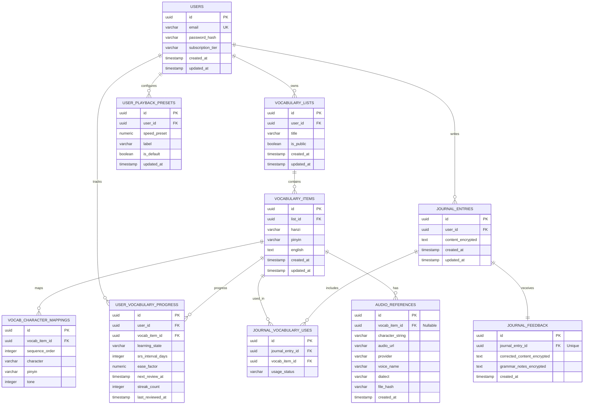

# HanziFlow — Database Schema Design

This document details the production-ready PostgreSQL database schema for the HanziFlow application. It enforces strict data integrity, type-safety, explicit character-pinyin mappings, and comprehensive auditing and indexing.

---

## 1. Entity Relationship Diagram

The following diagram illustrates the relationship between users, vocabulary lists, vocabulary items, explicit character-pinyin mappings, journal entries, audio references, and playback presets.



---

## 2. PostgreSQL DDL (Data Definition Language)

```sql
-- Enable necessary extensions
CREATE EXTENSION IF NOT EXISTS "uuid-ossp";

-- Define Enums for learning states, usage statuses, and subscription tiers
CREATE TYPE subscription_tier_enum AS ENUM ('FREE', 'PREMIUM');
CREATE TYPE learning_state_enum AS ENUM ('NEW', 'RECOGNIZED', 'ACTIVE_PRODUCTION', 'MASTERED');
CREATE TYPE usage_status_enum AS ENUM ('CORRECT', 'INCORRECT_GRAMMAR', 'IMPROVED_PHRASING');

-- 1. USERS TABLE
CREATE TABLE users (
    id UUID PRIMARY KEY DEFAULT uuid_generate_v4(),
    email VARCHAR(255) NOT NULL UNIQUE,
    password_hash VARCHAR(255) NOT NULL,
    subscription_tier subscription_tier_enum NOT NULL DEFAULT 'FREE',
    created_at TIMESTAMP WITH TIME ZONE DEFAULT CURRENT_TIMESTAMP NOT NULL,
    updated_at TIMESTAMP WITH TIME ZONE DEFAULT CURRENT_TIMESTAMP NOT NULL
);

-- Trigger to auto-update 'updated_at' timestamps
CREATE OR REPLACE FUNCTION update_timestamp()
RETURNS TRIGGER AS $$
BEGIN
    NEW.updated_at = CURRENT_TIMESTAMP;
    RETURN NEW;
END;
$$ LANGUAGE plpgsql;

CREATE TRIGGER trigger_update_users_timestamp
BEFORE UPDATE ON users
FOR EACH ROW EXECUTE FUNCTION update_timestamp();


-- 2. VOCABULARY LISTS TABLE
CREATE TABLE vocabulary_lists (
    id UUID PRIMARY KEY DEFAULT uuid_generate_v4(),
    user_id UUID NOT NULL REFERENCES users(id) ON DELETE CASCADE,
    title VARCHAR(100) NOT NULL,
    is_public BOOLEAN NOT NULL DEFAULT FALSE,
    created_at TIMESTAMP WITH TIME ZONE DEFAULT CURRENT_TIMESTAMP NOT NULL,
    updated_at TIMESTAMP WITH TIME ZONE DEFAULT CURRENT_TIMESTAMP NOT NULL
);

CREATE TRIGGER trigger_update_vocab_lists_timestamp
BEFORE UPDATE ON vocabulary_lists
FOR EACH ROW EXECUTE FUNCTION update_timestamp();


-- 3. VOCABULARY ITEMS TABLE
-- Stores target vocabulary words as a whole unit
CREATE TABLE vocabulary_items (
    id UUID PRIMARY KEY DEFAULT uuid_generate_v4(),
    list_id UUID NOT NULL REFERENCES vocabulary_lists(id) ON DELETE CASCADE,
    hanzi VARCHAR(100) NOT NULL,
    pinyin VARCHAR(150) NOT NULL,
    english TEXT NOT NULL,
    created_at TIMESTAMP WITH TIME ZONE DEFAULT CURRENT_TIMESTAMP NOT NULL,
    updated_at TIMESTAMP WITH TIME ZONE DEFAULT CURRENT_TIMESTAMP NOT NULL,
    -- Prevent duplicate words inside the same list
    CONSTRAINT unique_list_hanzi UNIQUE (list_id, hanzi)
);

CREATE TRIGGER trigger_update_vocab_items_timestamp
BEFORE UPDATE ON vocabulary_items
FOR EACH ROW EXECUTE FUNCTION update_timestamp();


-- 4. VOCAB CHARACTER MAPPINGS TABLE
-- Supports explicit, character-by-character mapping of Hanzi to Pinyin tones
CREATE TABLE vocab_character_mappings (
    id UUID PRIMARY KEY DEFAULT uuid_generate_v4(),
    vocab_item_id UUID NOT NULL REFERENCES vocabulary_items(id) ON DELETE CASCADE,
    sequence_order INTEGER NOT NULL CHECK (sequence_order >= 0),
    character VARCHAR(10) NOT NULL, -- Supports multi-character structures if needed, but typically single glyph
    pinyin VARCHAR(30) NOT NULL,
    tone INTEGER NOT NULL CHECK (tone BETWEEN 1 AND 5), -- 1st, 2nd, 3rd, 4th, and 5th (neutral) tones
    CONSTRAINT unique_vocab_char_sequence UNIQUE (vocab_item_id, sequence_order)
);


-- 5. USER VOCABULARY PROGRESS TABLE (SRS TRACKER)
-- Decoupled state and SRS information for scalability and user analytics tracking
CREATE TABLE user_vocabulary_progress (
    id UUID PRIMARY KEY DEFAULT uuid_generate_v4(),
    user_id UUID NOT NULL REFERENCES users(id) ON DELETE CASCADE,
    vocab_item_id UUID NOT NULL REFERENCES vocabulary_items(id) ON DELETE CASCADE,
    learning_state learning_state_enum NOT NULL DEFAULT 'NEW',
    srs_interval_days INTEGER NOT NULL DEFAULT 0 CHECK (srs_interval_days >= 0),
    ease_factor NUMERIC(4,3) NOT NULL DEFAULT 2.500 CHECK (ease_factor >= 1.300),
    next_review_at TIMESTAMP WITH TIME ZONE DEFAULT CURRENT_TIMESTAMP NOT NULL,
    streak_count INTEGER NOT NULL DEFAULT 0 CHECK (streak_count >= 0),
    last_reviewed_at TIMESTAMP WITH TIME ZONE,
    CONSTRAINT unique_user_vocab_item UNIQUE (user_id, vocab_item_id)
);


-- 6. JOURNAL ENTRIES TABLE
-- Stores user written entries. Content is encrypted at the application level to secure PII.
CREATE TABLE journal_entries (
    id UUID PRIMARY KEY DEFAULT uuid_generate_v4(),
    user_id UUID NOT NULL REFERENCES users(id) ON DELETE CASCADE,
    content_encrypted TEXT NOT NULL, -- Encrypted payload using AES-256-GCM
    created_at TIMESTAMP WITH TIME ZONE DEFAULT CURRENT_TIMESTAMP NOT NULL,
    updated_at TIMESTAMP WITH TIME ZONE DEFAULT CURRENT_TIMESTAMP NOT NULL
);

CREATE TRIGGER trigger_update_journal_entries_timestamp
BEFORE UPDATE ON journal_entries
FOR EACH ROW EXECUTE FUNCTION update_timestamp();


-- 7. JOURNAL VOCABULARY USES TABLE
-- Maps journal entries to the vocabulary words that the student attempted or succeeded in using.
CREATE TABLE journal_vocabulary_uses (
    id UUID PRIMARY KEY DEFAULT uuid_generate_v4(),
    journal_entry_id UUID NOT NULL REFERENCES journal_entries(id) ON DELETE CASCADE,
    vocab_item_id UUID NOT NULL REFERENCES vocabulary_items(id) ON DELETE CASCADE,
    usage_status usage_status_enum NOT NULL DEFAULT 'CORRECT',
    CONSTRAINT unique_journal_vocab_usage UNIQUE (journal_entry_id, vocab_item_id)
);


-- 8. JOURNAL FEEDBACK TABLE
-- Stores AI corrections and grammar recommendations. Data encrypted at application layer for safety.
CREATE TABLE journal_feedback (
    id UUID PRIMARY KEY DEFAULT uuid_generate_v4(),
    journal_entry_id UUID NOT NULL UNIQUE REFERENCES journal_entries(id) ON DELETE CASCADE,
    corrected_content_encrypted TEXT NOT NULL,
    grammar_notes_encrypted TEXT NOT NULL,
    created_at TIMESTAMP WITH TIME ZONE DEFAULT CURRENT_TIMESTAMP NOT NULL
);


-- 9. AUDIO REFERENCES TABLE
-- Links vocabulary items and arbitrary text to audio files (synthesized or recorded)
CREATE TABLE audio_references (
    id UUID PRIMARY KEY DEFAULT uuid_generate_v4(),
    vocab_item_id UUID REFERENCES vocabulary_items(id) ON DELETE SET NULL, -- Nullable for generic words/sentences
    character_string VARCHAR(255) NOT NULL, -- Target text mapped to this audio file
    audio_url VARCHAR(512) NOT NULL,
    provider VARCHAR(50) NOT NULL, -- e.g., 'AZURE_TTS', 'GOOGLE_TTS', 'NATIVE_BROWSER'
    voice_name VARCHAR(100) NOT NULL, -- e.g., 'zh-CN-XiaoxiaoNeural'
    dialect VARCHAR(50) NOT NULL, -- e.g., 'CN-STANDARD', 'TW-STANDARD'
    file_hash VARCHAR(64) NOT NULL, -- SHA-256 for tracking data corruption or audio modifications
    created_at TIMESTAMP WITH TIME ZONE DEFAULT CURRENT_TIMESTAMP NOT NULL
);


-- 10. USER PLAYBACK PRESETS TABLE
-- Custom speed playback configuration per user.
-- Constraints enforce strict limits on playback speed (between 0.25x and 2.0x)
CREATE TABLE user_playback_presets (
    id UUID PRIMARY KEY DEFAULT uuid_generate_v4(),
    user_id UUID NOT NULL REFERENCES users(id) ON DELETE CASCADE,
    speed_preset NUMERIC(3,2) NOT NULL CHECK (speed_preset >= 0.25 AND speed_preset <= 2.00),
    label VARCHAR(50) NOT NULL, -- e.g., 'Tone Isolated (Slow)', 'Natural Speed', 'Slightly Slow'
    is_default BOOLEAN NOT NULL DEFAULT FALSE,
    updated_at TIMESTAMP WITH TIME ZONE DEFAULT CURRENT_TIMESTAMP NOT NULL,
    CONSTRAINT unique_user_preset_label UNIQUE (user_id, label)
);

CREATE TRIGGER trigger_update_playback_presets_timestamp
BEFORE UPDATE ON user_playback_presets
FOR EACH ROW EXECUTE FUNCTION update_timestamp();

-- Enforce that a user only has one default playback preset
CREATE OR REPLACE FUNCTION enforce_single_default_preset()
RETURNS TRIGGER AS $$
BEGIN
    IF NEW.is_default = TRUE THEN
        UPDATE user_playback_presets
        SET is_default = FALSE
        WHERE user_id = NEW.user_id AND id <> NEW.id;
    END IF;
    RETURN NEW;
END;
$$ LANGUAGE plpgsql;

CREATE TRIGGER trigger_single_default_preset
BEFORE INSERT OR UPDATE ON user_playback_presets
FOR EACH ROW EXECUTE FUNCTION enforce_single_default_preset();
```

---

## 3. Database Indexes

To ensure fast lookup times under heavy usage and smooth UX during flashcard review and journaling, the following index strategy is implemented:

```sql
-- 1. Vocab List retrieval per user (Dashboard views)
CREATE INDEX idx_vocab_lists_user_id ON vocabulary_lists(user_id);

-- 2. Vocabulary items within a list (Flashcard learning sessions)
CREATE INDEX idx_vocab_items_list_id ON vocabulary_items(list_id);

-- 3. Lexical search on character string (Dynamic matches inside journal editor and dictionaries)
CREATE INDEX idx_vocab_items_hanzi ON vocabulary_items(hanzi);

-- 4. Spaced Repetition (SRS) queue retrieval (Fetches due cards instantly)
CREATE INDEX idx_user_vocab_progress_query 
ON user_vocabulary_progress(user_id, next_review_at) 
INCLUDE (learning_state, srs_interval_days);

-- 5. Explicit character-pinyin mappings lookup order
CREATE INDEX idx_vocab_char_mappings_lookup ON vocab_character_mappings(vocab_item_id, sequence_order);

-- 6. Journal entries chronological list per user
CREATE INDEX idx_journal_entries_user_date ON journal_entries(user_id, created_at DESC);

-- 7. Journal vocabulary uses lookup (Analyzing list coverage metrics)
CREATE INDEX idx_journal_vocab_uses_entry_id ON journal_vocabulary_uses(journal_entry_id);
CREATE INDEX idx_journal_vocab_uses_vocab_id ON journal_vocabulary_uses(vocab_item_id);

-- 8. Audio reference lookups for text string (Allows caching audio URLs by Hanzi character/phrase)
CREATE INDEX idx_audio_references_lookup ON audio_references(character_string, provider, voice_name);
```

---

## 4. Key Design Decisions & Validation Rationale

### 4.1 Strict Domain Boundaries on Playback Speed
We enforce `numeric(3,2)` and a CHECK constraint of `speed_preset >= 0.25 AND speed_preset <= 2.00`. Playback slower than `0.25x` suffers from phase-vocoder artifacts making tones unintelligible, while speeds higher than `2.00x` bypass human tone-processing capabilities. Constraining this at the database level guarantees boundary protection.

### 4.2 Explicit Character-to-Pinyin Tone Mappings
Instead of storing Pinyin as a single concatenated text block (e.g. `píngguǒ` for `苹果`), we enforce structural integrity with `vocab_character_mappings`. Each glyph is mapped to its exact pronunciation and integer tone rating (`1` to `5`). This solves two problems:
1. **Tone Color Rendering:** The client UI can selectively render colors per character block (e.g. `苹` = 2nd tone green, `果` = 3rd tone blue) without complex, error-prone string parsing at runtime.
2. **Multi-Pronunciation (Polyphonic / DuoYinZi) Support:** Characters like `得` (`de`, `dé`, `děi`) are isolated correctly by contextual sequence positioning.

### 4.3 PII and Leakage Protection via Application-Layer Encryption
Journal entries containing personal anecdotes are highly sensitive. To prevent accidental leakage during backups, DB replication, log dumps, or SQL injections:
*   `journal_entries.content_encrypted` and `journal_feedback` values are encrypted using AES-256-GCM.
*   The encryption keys are managed externally in a secure Key Management System (KMS) and never stored in the database.
*   Search is done metadata-wise (e.g., using `journal_vocabulary_uses` mapping tables) rather than plaintext wildcard SQL filters.
