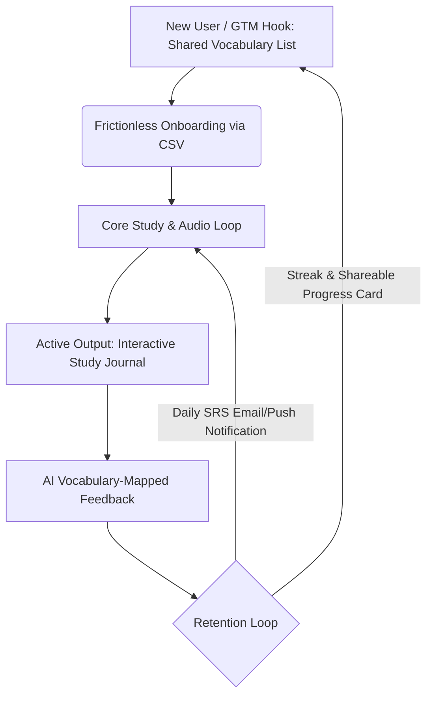

# HanziFlow — Product Specification Document
## Scientifically Optimized Chinese Vocabulary Studying & Journaling Application

---

## 1. Executive Summary & Business Case

### 1.1 The Business Opportunity
Chinese is widely recognized as one of the most difficult languages for Western learners to master. The core friction lies in the disconnect between three distinct components of a word: its **logographic character (Hanzi)**, its **phonetic representation and tone (Pinyin)**, and its **semantic meaning**. 

Existing solutions fail serious learners:
*   **Gamified Apps (e.g., Duolingo):** Rely on repetitive, low-retention translation matches and offer insufficient active production exercises.
*   **Dictionaries / SRS Tools (e.g., Pleco, Anki):** Excellent for looking up words or passive flashcard recognition, but lack contextual integration, structured writing practice, and modern user onboarding loops.
*   **Journaling/Tutor Services:** Traditional online tutoring is expensive, non-instantaneous, and lacks automated tracking of whether a student is successfully integrating their active study lists.

**HanziFlow** bridges this gap by combining structured vocabulary building with **active contextual output (journaling)**. By connecting a student's passive vocabulary list to an AI-driven, vocabulary-mapped writing environment, HanziFlow dramatically speeds up the transition from passive recognition to active production.

### 1.2 Target Audience
*   **Intermediate to Advanced-Beginner Learners (HSK 2–4):** Students who have passed the initial hurdle of basic pronunciation and are struggling to build, retain, and actively use a expanding pool of vocabulary.
*   **Serious Self-Learners & Professional Learners:** Professionals and students with specific vocabularies they want to acquire (e.g., Business Chinese, medical terminology, media studies) rather than generic pre-built lists.
*   **Academic Students:** Classroom learners who need a dedicated tool to input weekly vocabulary lists and practice writing compositions incorporating those words.

### 1.3 Monetization Model (Subscription Tiers & Premium Integrations)
To ensure rapid GTM validation while maintaining clear monetization paths, HanziFlow will operate on a Freemium SaaS model:

*   **Free Tier (Onboarding & Acquisition):**
    *   Manual and basic CSV vocabulary list uploads (up to 3 lists, max 50 words per list).
    *   Standard browser-synthesized text-to-speech (TTS) pronunciation audio.
    *   Daily study journal limit: 1 entry per day (max 150 characters) with basic grammar feedback.
*   **Premium Tier ($9.99/mo or $79.99/yr):**
    *   **Unlimited Vocabulary Lists & Capacity:** Upload and store unlimited words.
    *   **Premium Audio Integrations:** High-fidelity, natural-sounding neural audio voices (supporting multiple regional accents, e.g., Beijing Standard vs. Taiwan Standard).
    *   **Speed Playback Controls:** Fully adjustable pronunciation speeds (0.5x, 0.75x, 1.0x, 1.25x) to isolate tone transitions.
    *   **Interactive Study Journal (Pro):** Unlimited entries, advanced vocabulary-mapped feedback, rewrite suggestions, and contextual explanations mapping characters to Pinyin.
    *   **Spaced Repetition System (SRS) Analytics:** Visual tracking of vocabulary retention rates and active-recall curves.

---

## 2. Growth & Engagement Loops (GTM & Retention)



### 2.1 Go-To-Market (GTM) Leverage Hooks
*   **One-Click Shared Vocab Lists:** Users can generate unique, public sharing links for their custom-curated vocabulary lists. When shared on platforms like Reddit (r/ChineseLanguage) or Chinese-learning forums, new users can import these lists and start practicing in one click without even creating an account (cookie-based temporary session).
*   **The "Pinyin First" Positioning:** Position HanziFlow as the solution to "tone-deafness." Most flashcard systems hide Pinyin behind a tap, causing students to guess the tone or ignore it. HanziFlow's explicit "Pinyin Prioritization" acts as a strong marketing differentiator targeting learners frustrated by their inability to pronounce what they read.
*   **Visual Markdown/Social Export:** Upon finishing a journal entry, users can download an aesthetically pleasing, color-coded summary card showing their written entry, Pinyin transliteration, and highlighted vocabulary items used. This is optimized for sharing on Xiaohongshu (RED), Instagram, and Twitter.

### 2.2 Product Retention Loops
*   **The Active Production Feedback Loop:**
    1.  **Trigger:** User receives a notification that a set of target vocabulary is ready for active review.
    2.  **Action:** User writes a short journal entry using as many of those words as possible.
    3.  **Variable Reward:** AI returns detailed, vocabulary-mapped corrections showing exactly how they integrated their targets, alongside improved native phrasing.
    4.  **Investment:** The corrected sentences and words are added to their active mastery pool, feeding their progress metrics.
*   **Daily Writing Streak & Cohort Accountability:** A simple, low-pressure writing streak tracker combined with a weekly digest email highlighting "New Words Mastered in Context" rather than just "Words Seen."

---

## 3. Core MVP Features & Learning Science Rationale

```
+-----------------------------------------------------------------------------------+
|  [Hanziflow Logo]                                                 User: John Doe  |
+-----------------------------------------------------------------------------------+
|  Target Vocabulary Deck: "HSK 3 - Eating Out"                      [Export List]  |
|                                                                                   |
|  1. 苹果  [ píngguǒ ]  (Apple)     [Play Audio]  Speed: |---o---| (0.75x)         |
|  2. 菜单  [ càidān ]   (Menu)      [Play Audio]                                   |
|                                                                                   |
+-----------------------------------------------------------------------------------+
|  Interactive Study Journal                                                       |
|                                                                                   |
|  "我想看看 菜单[càidān]。我喜欢吃 苹果[píngguǒ]..."                                |
|  [                                                                             ]  |
|  [ Type your Chinese journal entry here. Hover words to see target status.    ]  |
|  [                                                                             ]  |
|                                                                                   |
|  Target words integrated: [ 苹果 x ] [ 菜单 x ]                                 |
|  [Submit Journal for Feedback]                                                    |
+-----------------------------------------------------------------------------------+
|  Feedback Panel:                                                                  |
|  - Excellent! You integrated 2 target vocabulary words correctly.                 |
|  - Suggestion: "我想看看菜单" is natural. To make it more polite, try             |
|    "我想看一下菜单 (wǒ xiǎng kàn yíxià càidān)."                                 |
+-----------------------------------------------------------------------------------+
```

### 3.1 CSV Vocabulary Onboarding
*   **Description:** A simple, drag-and-drop CSV importer that accepts files with `Character`, `Pinyin`, and `Definition` columns. The system automatically parses these files, checks for missing Pinyin or definitions, and creates a customized study deck.
*   **Learning Science Rationale (Agency & Personalization):** Cognitive psychology shows that memory formation is deeply tied to personal relevance (the **Self-Reference Effect**). Generic decks force learners to memorize irrelevant words, leading to rapid extinction of the memory trace. Importing custom lists (e.g., from a podcast they listened to or an article they read) guarantees high emotional and practical utility, maximizing retention.

### 3.2 Pinyin Prioritization
*   **Description:** Throughout the entire interface—whether in flashcard view, writing mode, or feedback screens—Pinyin is displayed directly alongside or above characters by default. Pinyin tones are color-coded (e.g., 1st tone red, 2nd tone green, 3rd tone blue, 4th tone purple, neutral gray) to build visual muscle memory for pitch contour.
*   **Learning Science Rationale (Reducing Cognitive Load & Split-Attention Effect):** Reading Chinese characters requires simultaneous retrieval of phonology (pronunciation/tone) and semantics (meaning) from a single abstract glyph. For non-native speakers, displaying characters without immediate, adjacent Pinyin causes **cognitive friction** and splits attention, forcing the brain to constantly switch between searching memory for pronunciation and reading. Integrating Pinyin alongside Hanzi supports the **dual-coding theory**, facilitating faster, lower-stress orthographic mapping.

### 3.3 Audio Pronunciations
*   **Description:** Playback buttons placed next to every vocabulary word, example sentence, and student journal sentence. Uses Web Speech API (SpeechSynthesis) for standard accounts and high-quality neural voice synthesis APIs (e.g., Microsoft Azure Cognitive Services or Google Cloud TTS) for premium users.
*   **Learning Science Rationale (Phonological Loop & Sensory Integration):** Working memory relies heavily on the **phonological loop**—a brief store of verbal information kept active through subvocal rehearsal. Without immediate auditory reinforcement, learners construct inaccurate internal pronunciations or misremember tones, cementing bad habits. High-quality audio provides the correct phonological target for replication.

### 3.4 Speed Playback Controls
*   **Description:** A simple slider or preset toggle buttons (0.5x, 0.75x, 1.0x) allowing the user to slow down the speed of the spoken audio.
*   **Learning Science Rationale (Acoustic Temporal Processing & Tone Discrimination):** Mandarin Chinese tones are pitch contours (changes in frequency over time). At native conversational speed, these pitch contours are compressed and affected by **tone sandhi** (changes due to adjacent characters), making them sound like a continuous blur to a beginner's ear. Slowing down the speed allows the auditory cortex to segment phonemes and trace the full physical rise, fall, or dip of the tone, critical for developing accurate listening and pronunciation schemas.

### 3.5 Interactive Study Journal
*   **Description:** A split-screen workspace where the user writes a journal entry in Chinese characters on the left, while viewing their target vocabulary deck on the right. When the user types, the system dynamically checks for matches. Upon submission, an AI prompts feedback showing:
    1.  Which target words were successfully integrated.
    2.  Which target words were used in the wrong grammatical context.
    3.  A natural, corrected version of their writing, complete with Pinyin subtitles and audio playback.
*   **Learning Science Rationale (Active Production & Elaborative Semantic Encoding):** Passive recognition (seeing a word on a card) is represented by weak neural connections. **Elaborative encoding** occurs when a learner is forced to actively retrieve a word from memory and construct a novel sentence around it. This active production (journaling) stimulates deeper levels of cognitive processing. By obtaining instant, vocabulary-mapped corrective feedback, the brain consolidates the correct syntax while the context is still fresh in working memory.

---

## 4. Minimum Product Scope (MVP) & Technology Roadmap

To prioritize GTM speed-to-market and avoid premature scaling or architectural over-engineering, the MVP will utilize a streamlined stack and direct integrations.

### 4.1 Tech Stack
*   **Frontend:** React (Next.js) hosted on Vercel (or static files hosted on Firebase). Clean Tailwind CSS UI.
*   **Database & Auth:** Firebase Auth + Cloud Firestore. Simple document structures for users, lists, and journals.
*   **Audio Synthesis:** Native Browser Web Speech API (`window.speechSynthesis`) for MVP to bypass server-side audio generation costs.
*   **AI Engine:** Direct serverless calls to Gemini / GPT API with structured JSON output for grammatical corrections.

### 4.2 Minimum Data Models
```json
// User Vocabulary List
{
  "listId": "user_123_hsk3",
  "userId": "user_123",
  "title": "HSK 3 Food Vocabulary",
  "words": [
    { "character": "苹果", "pinyin": "píngguǒ", "definition": "apple" },
    { "character": "菜单", "pinyin": "càidān", "definition": "menu" }
  ]
}

// Journal Entry
{
  "entryId": "entry_987",
  "userId": "user_123",
  "date": "2026-06-18",
  "content": "我想看看菜单。我喜欢吃苹果。",
  "targetWordsUsed": ["苹果", "菜单"],
  "feedback": {
    "correctedContent": "我想看一下菜单。我喜欢吃苹果。",
    "grammarNotes": "Changed '我想看看菜单' to '我想看一下菜单' to sound more natural when ordering.",
    "vocabEvaluation": [
      { "word": "苹果", "status": "correct" },
      { "word": "菜单", "status": "correct_but_phrasing_improved" }
    ]
  }
}
```

### 4.3 Out-of-Scope for MVP (Phase 2 & 3 Enhancements)
*   **No custom mobile apps:** Fully responsive web application first.
*   **No offline databases:** Requires internet connection to process AI and sync lists.
*   **No user-to-user social networking:** Shared links will be static webpage views (no chat, no comments).
*   **No complex speech-to-text pronunciation assessment:** Focus on listening and writing production first.

---

## 5. Success Metrics & Launch Plan

### 5.1 Key Performance Indicators (KPIs)
1.  **Vocabulary Import Volume:** Total number of lists imported via CSV (measures acquisition and onboarding friction).
2.  **Journal Submission Frequency (Weekly Retention Loop):** The percentage of users writing at least 2 journal entries per week.
3.  **Active-to-Paid Conversion Rate:** Ratio of free tier users upgrading to Pro after using the Journal feature 5 times.
4.  **Shared Link Virality:** The K-factor of new signups coming through shared vocabulary list URLs.

### 5.2 Launch Schedule (4-Week GTM Plan)
*   **Week 1: Core Onboarding & Vocab View:** Build the CSV importer, list viewer, and Pinyin renderer. Set up Firebase.
*   **Week 2: Audio & Playback:** Add the Web Speech API TTS engine and the speed control slider.
*   **Week 3: Interactive Journal & AI Feedback:** Implement the writing interface and prompt engineering for the Gemini API feedback loop.
*   **Week 4: Growth Features & Launch:** Add one-click sharing, SEO landing page, and Stripe payment gateway. Launch on Product Hunt, Hacker News, and Chinese learning subreddits.
