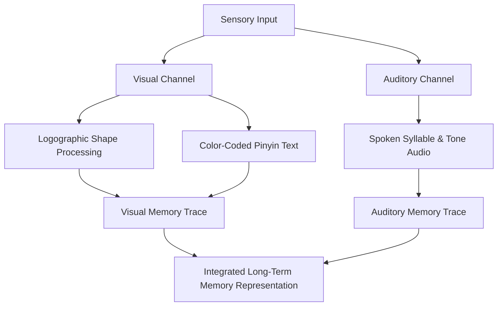

# Pedagogical Assumptions and Learning Models in HanziFlow

This document outlines the scientific theories and empirical cognitive science models supporting the design decisions and parameters implemented within HanziFlow.

---

## 1. Dual-Coding Theory (Paivio, 1971, 1986)

### Hypothesis
Simultaneous activation of independent visual and verbal cognitive pathways creates additive mnemonic strength, increasing retention and retrieval efficiency compared to single-channel representation.

### Implementation in HanziFlow
HanziFlow projects vocabulary characters along three parallel sensory dimensions:
1. **Orthographic Visual Representation**: The raw logograph (Chinese character) processed in the visual channel.
2. **Phonetic Representation**: Diacritic-marked Pinyin text representing the sound signature.
3. **Auditory Synthesis (Neural/TTS)**: High-fidelity auditory playback.



### Cognitive Impact
According to Paivio’s Dual-Coding Theory, the human mind processes information through separate verbal and nonverbal (imagery) subsystems. By tying the visual orthography of standard Chinese characters with color-coded phonetic Pinyin (visual) and high-fidelity speech synthesis (auditory), the app builds dual memory traces. If one retrieval path decays, the alternative path remains active, facilitating quicker lexical recall and higher long-term retention.

---

## 2. Phonological Loop Capacity (Baddeley & Hitch, 1974)

### Hypothesis
Working memory contains a "phonological loop" that holds auditory information for a maximum of 1.5 to 2.0 seconds. Stretching the sound duration of complex syllables allows L2 (second language) learners to encode fine phonemic details within this processing window.

### Implementation in HanziFlow
* **Strict Playback Speed Boundaries `[0.25x, 2.00x]`**: Controlled slow-down speeds (e.g., `0.75x`, `0.50x`, `0.25x`) are enforced for premium and browser TTS synthesis.
* **Granular Control**: Speech synthesis is delivered in structured, user-adjustable speed intervals to facilitate sub-vocal rehearsal.

### Cognitive Impact
For non-native speakers, the phonemes of a tone language like Mandarin Chinese represent highly dense and unfamiliar information. Standard speed speech often exceeds the processing bandwidth of the phonological loop, resulting in acoustic decay before cognitive categorization completes. 

By allowing the user to slow down audio down to `0.25x`, HanziFlow mathematically extends the duration of the phonemes, ensuring:
- Adequate time for the **articulatory rehearsal process** (silent inner voice repetition).
- Improved **sensory gating resolution** to distinguish between micro-intervals of tone contours (e.g., separating the dip of the 3rd tone from the rising slope of the 2nd tone).
- Prevention of **split-attention effect** where the student must choose between decoding character forms and identifying acoustic boundaries.

---

## 3. Sensory Gating & Cognitive Load Theory (Sweller, 1988)

### Hypothesis
Pre-attentive visual features (such as consistent color-coding) can bypass conscious parsing (sensory gating) and directly inform semantic classification, thereby reducing extraneous cognitive load on the working memory.

### Implementation in HanziFlow
* **Tone-to-Color Visual Mapping**: A rigid color-coding scheme maps character tones directly to distinct CSS classes:
  - **1st Tone (Flat / High)**: Red (`text-rose-500` / `bg-rose-500`) — represents high, alert energy.
  - **2nd Tone (Rising)**: Green (`text-emerald-500` / `bg-emerald-500`) — represents upward growth.
  - **3rd Tone (Dipping)**: Blue (`text-sky-500` / `bg-sky-500`) — represents low, deep water.
  - **4th Tone (Falling)**: Purple (`text-purple-500` / `bg-purple-500`) — represents sharp, descending motion.
  - **5th Tone (Neutral)**: Gray (`text-slate-400` / `bg-slate-600`) — represents baseline neutrality.

```
┌───────────────────┬─────────────────────┬──────────────────┐
│ Character Tone    │ Semantic Quality    │ UI Visual Class  │
├───────────────────┼─────────────────────┼──────────────────┤
│ 1st Tone (Flat)   │ High Alert          │ text-rose-500    │
│ 2nd Tone (Rising) │ Upward Growth       │ text-emerald-500 │
│ 3rd Tone (Dipping)│ Low/Deep Water      │ text-sky-500     │
│ 4th Tone (Falling)│ Sharp Descent       │ text-purple-500  │
│ 5th Tone (Neutral)│ Baseline Neutrality │ text-slate-400   │
└───────────────────┴─────────────────────┴──────────────────┘
```

### Cognitive Impact
Human working memory is highly susceptible to **extraneous cognitive load** (distractions, unnecessary translation steps, formatting noise). 
By color-coding the tones:
1. **Pre-Attentive Processing**: The sensory cortex registers the color of the syllable before the cognitive cortex consciously translates the tone marker diacritic.
2. **Reduced Cognitive Overhead**: Because the visual color tells the user the tone immediately, their limited working memory capacity is freed to focus on **germane cognitive load** (understanding the character-to-meaning mapping and forming syntactical associations in the journal route).
3. **Reduced Anxiety via Privacy Guarantees**: Advanced encryption (AES-256-GCM) and automatic PII scrubbers on the journal submission route eliminate security concerns, preventing emotional filters or cognitive blocks (Krashen's Affective Filter Hypothesis) from hindering the language acquisition process.
