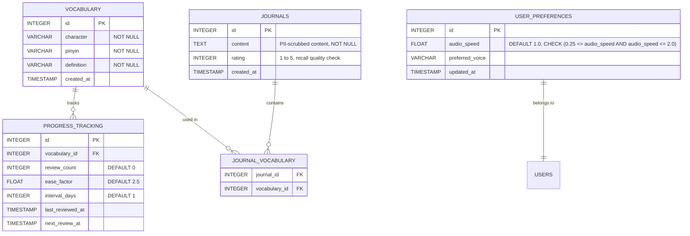

# HanziFlow - Database Schema

This document maps out the relational database tables, fields, relationships, and constraints required for HanziFlow. 

---

## 1. Entity Relationship Diagram



---

## 2. Table Definitions & SQL Schema

### 2.1 `vocabulary`
Stores the target words imported via CSV or added manually.
```sql
CREATE TABLE vocabulary (
    id SERIAL PRIMARY KEY,
    character VARCHAR(255) NOT NULL,
    pinyin VARCHAR(255) NOT NULL,
    definition TEXT NOT NULL,
    created_at TIMESTAMP DEFAULT CURRENT_TIMESTAMP
);
```

### 2.2 `journals`
Stores user-composed sentences/reflections. Data must be scrubbed of PII prior to persistence or reviewed safely.
```sql
CREATE TABLE journals (
    id SERIAL PRIMARY KEY,
    content TEXT NOT NULL, -- Must be run through PII scrubber in server
    rating INTEGER CHECK (rating >= 1 AND rating <= 5) NOT NULL,
    created_at TIMESTAMP DEFAULT CURRENT_TIMESTAMP
);
```

### 2.3 `journal_vocabulary`
A junction table establishing a many-to-many relationship between journals and the vocabulary words applied.
```sql
CREATE TABLE journal_vocabulary (
    journal_id INTEGER REFERENCES journals(id) ON DELETE CASCADE,
    vocabulary_id INTEGER REFERENCES vocabulary(id) ON DELETE CASCADE,
    PRIMARY KEY (journal_id, vocabulary_id)
);
```

### 2.4 `progress_tracking`
Maintains spaced-repetition metrics for each vocabulary item.
```sql
CREATE TABLE progress_tracking (
    id SERIAL PRIMARY KEY,
    vocabulary_id INTEGER REFERENCES vocabulary(id) ON DELETE CASCADE UNIQUE,
    review_count INTEGER DEFAULT 0 NOT NULL,
    ease_factor FLOAT DEFAULT 2.5 NOT NULL,
    interval_days INTEGER DEFAULT 1 NOT NULL,
    last_reviewed_at TIMESTAMP,
    next_review_at TIMESTAMP DEFAULT CURRENT_TIMESTAMP
);
```

### 2.5 `user_preferences`
Stores custom configuration settings with strict audio speed range constraints.
```sql
CREATE TABLE user_preferences (
    id SERIAL PRIMARY KEY,
    audio_speed NUMERIC(3, 2) NOT NULL DEFAULT 1.00,
    preferred_voice VARCHAR(100),
    updated_at TIMESTAMP DEFAULT CURRENT_TIMESTAMP,
    CONSTRAINT chk_audio_speed CHECK (audio_speed >= 0.25 AND audio_speed <= 2.0)
);
```
