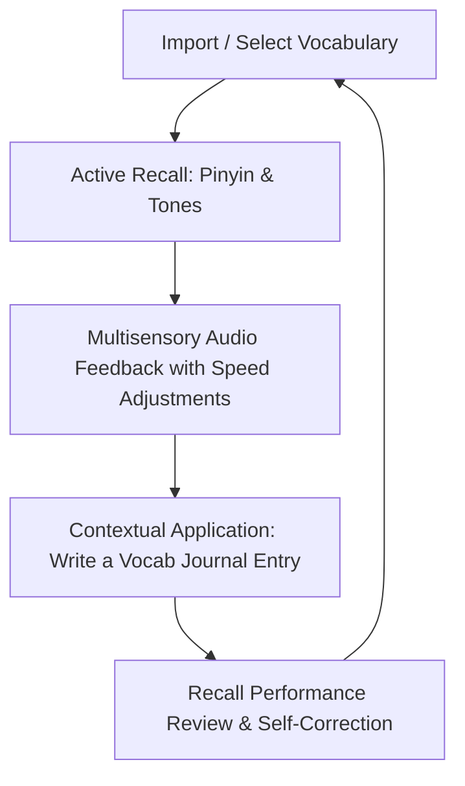

# HanziFlow - Product Design Document

## 1. Overview & Vision
HanziFlow is a scientifically optimized vocabulary studying and journaling application designed for learners of Chinese (Mandarin). By combining active recall (Pinyin recall cards), multisensory feedback (audio playback with adjustable speed), and contextual learning (vocabulary journaling), HanziFlow builds deep, lasting retention.

---

## 2. Target Users
* **Intermediate & Advanced Learners**: Students who have moved past basic greeting phrases and need to build a massive vocabulary of characters, collocations, and contextual phrases.
* **Professionals / Academic Learners**: Learners who require precise pronunciation (tones) and recognition of specialized vocabulary.
* **Reflective Learners**: Students who want to practice writing or typing self-reflective sentences (journals) using target vocabulary to reinforce context and retention.

---

## 3. Onboarding & Core Loops

### Onboarding Loop
1. **Welcome & Clean Slate**: The user lands on a clean dashboard showing empty study metrics.
2. **CSV Import**: The user imports their own list of Chinese characters, pinyin, and definitions (e.g., from Anki or custom spreadsheets) to quickly populate their deck. A sample template is provided to ensure smooth boarding.
3. **First Review**: The app guides the user through their first 5 cards to introduce the active recall mechanic.
4. **Journal Action**: The user writes a short sentence incorporating at least one active vocabulary word to close the initial learning loop.

### Core Engagement Loop

---

## 4. MVP Feature Selection

### Feature 1: Pinyin Recall Cards
* **Description**: Flashcards designed to test character recognition and Pinyin/tone recall.
* **Behavior**: Displays the Chinese character(s). The user guesses the Pinyin and definition, then clicks "Reveal" to check their accuracy.
* **Scientific Basis**: Active recall forces the brain to retrieve the phonetics and tones before seeing them, strengthening neural paths.

### Feature 2: CSV Import
* **Description**: Quick data ingestion for user-generated lists.
* **Behavior**: Accepts a CSV file with three columns: `character`, `pinyin`, `definition`. Parsed data is immediately added to the user's active study pool.
* **Scientific Basis**: Personalization increases motivation; learners acquire vocabulary faster when it is relevant to their daily life or reading.

### Feature 3: Audio Player with Speed Slider
* **Description**: A pronunciation audio player using SpeechSynthesis.
* **Behavior**: Features a play button and a speed slider ranging from **0.25x to 2.0x**.
* **Scientific Basis**: Slowing down pronunciation allows learners to dissect tone transitions and initial/final consonant combinations. Speeding up prepares them for native speech rates.

### Feature 4: Vocabulary Journal
* **Description**: A writing prompt area where users compose sentences containing target words.
* **Behavior**: Users select a vocabulary word and write a journal entry. They receive a rating or feedback on their recall confidence. The system ensures PII (Personally Identifiable Information) is scrubbed or warnings are provided during logging.
* **Scientific Basis**: Contextual output (generation effect) shifts passive recognition into active output capacity.
