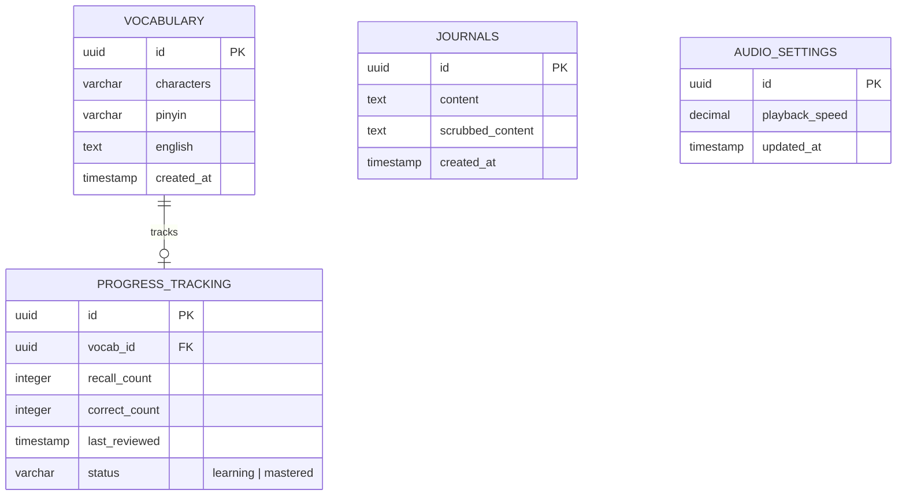

# HanziFlow - Database Schema Document

This document outlines the relational database schema designed for HanziFlow. To support rapid GTM and simple deployment, the schema is designed for PostgreSQL or SQLite.

## Entity Relationship Diagram (Conceptual)


---

## 1. Table Definitions

### `vocabulary`
Stores the target Chinese characters, their Pinyin romanization, and English translations.
*Indexes are placed on characters to speed up lookup during journal scans.*

```sql
CREATE TABLE vocabulary (
    id UUID PRIMARY KEY DEFAULT gen_random_uuid(),
    characters VARCHAR(255) NOT NULL UNIQUE,
    pinyin VARCHAR(255) NOT NULL,
    english TEXT NOT NULL,
    created_at TIMESTAMP DEFAULT CURRENT_TIMESTAMP NOT NULL
);

CREATE INDEX idx_vocab_characters ON vocabulary(characters);
```

### `journals`
Stores daily journal entries written by students. To comply with privacy standards, a raw `content` field is stored locally, and a `scrubbed_content` (PII scrubbed) is sent to external analysis APIs.

```sql
CREATE TABLE journals (
    id UUID PRIMARY KEY DEFAULT gen_random_uuid(),
    content TEXT NOT NULL,
    scrubbed_content TEXT NOT NULL,
    created_at TIMESTAMP DEFAULT CURRENT_TIMESTAMP NOT NULL
);
```

### `progress_tracking`
Tracks the user's recall history for flashcards and journal output. Contains performance metrics for spaced repetition systems (SRS) or general retention tracking.

```sql
CREATE TABLE progress_tracking (
    id UUID PRIMARY KEY DEFAULT gen_random_uuid(),
    vocab_id UUID NOT NULL REFERENCES vocabulary(id) ON DELETE CASCADE,
    recall_count INTEGER DEFAULT 0 NOT NULL,
    correct_count INTEGER DEFAULT 0 NOT NULL,
    last_reviewed TIMESTAMP DEFAULT CURRENT_TIMESTAMP NOT NULL,
    status VARCHAR(50) DEFAULT 'learning' NOT NULL CHECK (status IN ('learning', 'mastered'))
);

CREATE UNIQUE INDEX idx_progress_vocab ON progress_tracking(vocab_id);
```

### `audio_settings`
Stores user-specific audio configuration, particularly custom playback speeds.
*We enforce a CHECK constraint to ensure that custom playback speeds stay within the scientifically safe, undistorted limits (0.5x to 2.0x).*

```sql
CREATE TABLE audio_settings (
    id UUID PRIMARY KEY DEFAULT gen_random_uuid(),
    playback_speed NUMERIC(3, 2) NOT NULL DEFAULT 1.00 CHECK (playback_speed >= 0.50 AND playback_speed <= 2.00),
    updated_at TIMESTAMP DEFAULT CURRENT_TIMESTAMP NOT NULL
);
```
