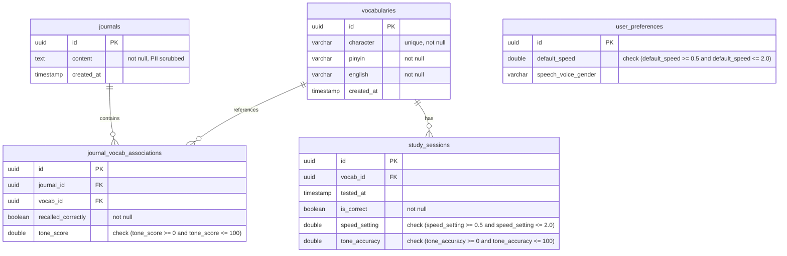

# HanziFlow - Database Schema Design

This document details the relational database schema optimized for HanziFlow's scientific vocabulary logging, journaling analysis, and performance tracking.

## Table Definitions

### 1. `vocabularies`
Stores target Chinese characters, their official Pinyin phonetic representation, and English translations.
- **Fields**:
  - `id`: `UUID` (Primary Key, default: `gen_random_uuid()`)
  - `character`: `VARCHAR(255)` (Unique index, represents Hanzi, e.g., "学习")
  - `pinyin`: `VARCHAR(255)` (Phonetic spelling with tone marks/numbers, e.g., "xuéxí")
  - `english`: `VARCHAR(1024)` (English translation, e.g., "to study, to learn")
  - `created_at`: `TIMESTAMP` (Default: `CURRENT_TIMESTAMP`)
- **Indexes**:
  - `idx_vocab_character` (Unique index on `character` for O(1) query lookup)

### 2. `journals`
Stores daily diary or practice sentences written by learners. Content is scrubbed of PII (names, emails, phone numbers, addresses) prior to persistence.
- **Fields**:
  - `id`: `UUID` (Primary Key)
  - `content`: `TEXT` (Scrubbed journal content)
  - `created_at`: `TIMESTAMP` (Default: `CURRENT_TIMESTAMP`)

### 3. `journal_vocab_associations`
Maps which vocabulary words were intended/tested in each journal entry and details the active recall outcome.
- **Fields**:
  - `id`: `UUID` (Primary Key)
  - `journal_id`: `UUID` (Foreign Key referencing `journals.id` ON DELETE CASCADE)
  - `vocab_id`: `UUID` (Foreign Key referencing `vocabularies.id` ON DELETE CASCADE)
  - `recalled_correctly`: `BOOLEAN` (Indicates if the user used/recalled the word correctly)
  - `tone_score`: `DOUBLE PRECISION` (Tone accuracy percentage from 0 to 100. Constraint: `tone_score BETWEEN 0.0 AND 100.0`)
- **Indexes**:
  - `idx_journal_vocab` (Composite index on `journal_id` and `vocab_id`)

### 4. `study_sessions`
Tracks flashcard active recall events, including exact tone accuracy and speed settings during the session.
- **Fields**:
  - `id`: `UUID` (Primary Key)
  - `vocab_id`: `UUID` (Foreign Key referencing `vocabularies.id` ON DELETE CASCADE)
  - `tested_at`: `TIMESTAMP` (Default: `CURRENT_TIMESTAMP`)
  - `is_correct`: `BOOLEAN` (True if exact match, false otherwise)
  - `speed_setting`: `DOUBLE PRECISION` (Constraint: `speed_setting >= 0.5 AND speed_setting <= 2.0`)
  - `tone_accuracy`: `DOUBLE PRECISION` (Constraint: `tone_accuracy >= 0.0 AND tone_accuracy <= 100.0`)

### 5. `user_preferences`
App configuration preferences for SpeechSynthesis audio.
- **Fields**:
  - `id`: `UUID` (Primary Key)
  - `default_speed`: `DOUBLE PRECISION` (Constraint: `default_speed >= 0.5 AND default_speed <= 2.0`, default: `1.0`)
  - `speech_voice_gender`: `VARCHAR(50)` (Preferred voice gender classification)

## Empirical Constraints & Validation Logic
1. **Speed Bounds**: `speed_setting` and `default_speed` are enforced at the database layer via check constraints to strictly range from `0.5` to `2.0`.
2. **Normalized Tone Boundaries**: All `tone_score` and `tone_accuracy` values are percentage-bound (`[0.0, 100.0]`).
3. **Cascades**: Deletion of a vocabulary card or journal entry automatically cleans up junction tables to maintain referential integrity.
