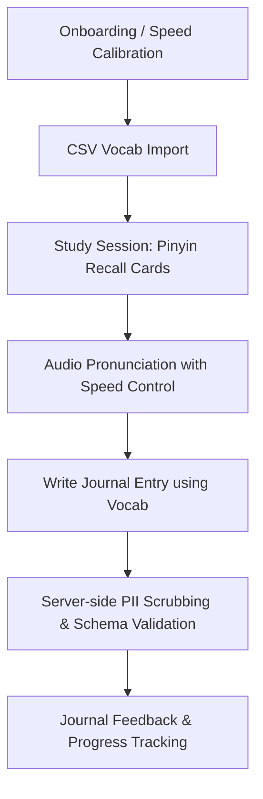

# HanziFlow - Product Design Document

HanziFlow is a scientifically optimized Chinese vocabulary studying and journaling application. It combines active recall flashcards (Pinyin recall) with context-driven learning (journaling) to bridge the gap between passive vocabulary recognition and active language production.

## 1. Target Users
* **Intermediate Chinese Learners (HSK 3-5):** Users who have acquired a base vocabulary but struggle to use these words in natural, contextually appropriate sentences.
* **Active Production Learners:** Students preparing for writing-intensive examinations or real-world conversations who need to move words from passive memory to active production.
* **Systematic Language Studiers:** Learners who appreciate structured review schedules, custom audio speeds, and quantitative tracking of their learning progress.

## 2. Onboarding Loop
1. **Welcome & Philosophy Introduction:** Educate the user on the science of active recall and contextual writing (why journaling vocabulary works better than standard rote memorization).
2. **Speed Calibration:** A simple audio configuration step where the user sets their preferred TTS/audio playback speed (clamped between 0.5x and 2.0x).
3. **Initial Vocabulary Import:** Prompt the user to either start with a default vocabulary list or upload their own list via a CSV file (validating character, pinyin, and English definition columns).
4. **First Journal Prompt:** Guide the user to write their first journal entry utilizing at least one newly imported vocabulary word, demonstrating the core workflow.

## 3. MVP Feature Selection

### A. CSV Vocabulary Import
* **Purpose:** Allows users to populate their study database with custom lists.
* **Key Requirements:**
  * Client-side parsing and CSV validation before uploading.
  * Server-side schema enforcement, sanitization, and structured responses.
  * Prevention of duplicate terms.

### B. Pinyin Recall Cards
* **Purpose:** Tests the user's active recall of Pinyin and English meanings for a given Chinese Character (Hanzi).
* **Key Requirements:**
  * Display Hanzi prominently, with optional toggles for Pinyin and definitions.
  * A text input box for the user to type the Pinyin (either numbered tone format like `hao3` or accented pinyin like `hǎo`).
  * Instant feedback comparing the user's input with the canonical pinyin.

### C. Audio Player with Speed Slider
* **Purpose:** Pronounces characters/sentences to aid listening comprehension at various learning stages.
* **Key Requirements:**
  * HTML5 SpeechSynthesis fallback on the client side, allowing dynamic speed scaling.
  * A speed range slider extending from `0.5` to `2.0` (with `0.1` increments).
  * Backend audio retrieval API route which strictly validates and clamps the speed parameter to prevent denial-of-service (DoS) via resource exhaustion or invalid values.

### D. Vocab Journal & Recall Feedback
* **Purpose:** The ultimate tool for active production. Users write journal entries in Chinese and tag the vocabulary words they attempted to use.
* **Key Requirements:**
  * Text area for writing.
  * Auto-detection of target vocabulary words in the journal text.
  * Privacy filtering: PII (Personally Identifiable Information) scrubbing on the server side (scanning for emails, phone numbers, and identity cards) before persisting the review.
  * Success rating (Recall Feedback): User records whether they found it easy, medium, or hard to use each word in context.

## 4. User Flows

