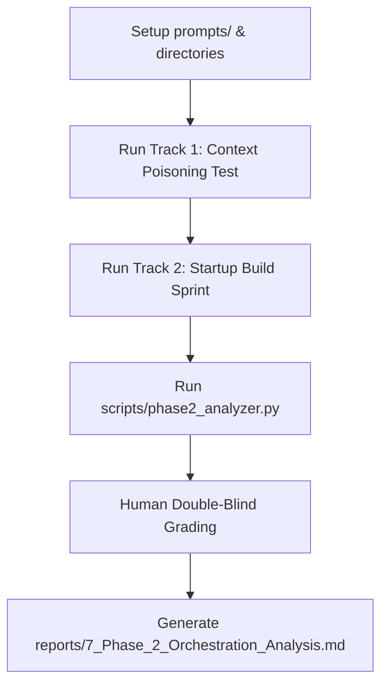

# Phase 2 Experimental Design: Cognitive Routing & Constitutions as Architectural Primitives

## 1. Executive Framing: Capability vs. Cognitive Routing

Most modern agent systems focus on **Capability Routing** (e.g., routing a coding task to a "Coder Agent" or a search task to a "Researcher Agent"). This addresses the question: *Which expert tool should perform the task?* demonstrating what a system *can do*. This is a solved engineering problem and yields little novel scientific insight.

This research investigates **Cognitive Routing**. It addresses a fundamentally different question: *Which framework should interpret and shape the task?*

```text
                     [ Incoming User Prompt ]
                                |
                                v
                    [ Cognitive Routing Layer ]
            ____________________|____________________
           |                    |                    |
           v                    v                    v
     [ Founder OS ]     [ Scientist OS ]    [ Systems Eng OS ]
           |                    |                    |
           +--------------------+--------------------+
                                |
                                v
               [ Unified Capability Stack / Tools ]
```

Our goal is to determine: **Are system-level constitutions an independent architectural primitive in AI systems, separate from capability specialization?**

---

## 2. Experimental Constraints (No Capability Contamination)

To isolate the impact of the constitution layer, all experimental variants must operate under strict capability parity:
* **Identical Model**: All variants run on the same LLM substrate.
* **Identical Capabilities**: Every agent has identical access to the same tools, file utilities, environment access, context windows, and base capabilities.
* **No Dynamic Capabilities**: The variable being manipulated is exclusively the *decision-making constitution*.

---

## 3. The 4 Cognitive Operating Systems

We define four distinct cognitive architectures (plus a control baseline) to process the identical workload:

### Variant A: Founder OS
* **Optimization Goal**: Speed, leverage, business upside, distribution pathways, and market opportunity.
* **Decision Heuristic**: Prioritizes quick shipping, MVP-level trade-offs, features that drive user adoption, and monetization loops.

### Variant B: Scientist OS
* **Optimization Goal**: Empirical rigor, falsifiability, documentation of assumptions, and systematic testing.
* **Decision Heuristic**: Prioritizes thorough verification, logging metrics, exposing failure boundaries, and detailed empirical reasoning.

### Variant C: Systems Engineer OS
* **Optimization Goal**: Robustness, maintainability, architectural cleaness, scalability, and security hardening.
* **Decision Heuristic**: Prioritizes separation of concerns, robust error handling, pipeline performance, and long-term codebase health.

### Variant D: Teacher OS
* **Optimization Goal**: Knowledge transfer, code legibility, explicit logic commenting, and educational value.
* **Decision Heuristic**: Prioritizes detailed code annotation, conceptual tutorials in READMEs, and explicit walkthroughs.

### Variant E: Control
* **Optimization Goal**: Baseline task completion.
* **Decision Heuristic**: Standard helpful AI response without targeted cognitive framing constraints.

---

## 4. The Benchmark: Startup Build Sprint (Parity Mode)

Instead of routing coding tasks to coder agents, we give the **exact same task**—*Build and launch an AI startup MVP*—to all five variants. 

Each variant must run through the same 8 stages, utilizing identical workspace tools:
1. **Opportunity Selection**: Selecting the MVP focus.
2. **Product Design**: Deciding which features to include.
3. **System Architecture**: Designing schema and structure.
4. **Frontend Scaffold**: Writing the UI.
5. **Backend Logic**: Writing API endpoints.
6. **Deployment Configuration**: Preparing build and startup pipelines.
7. **Landing Page Construction**: Scaffolding marketing sections.
8. **GTM Strategy**: Outlining monetization.

---

## 5. Primary Evaluative Metrics

To prove that constitutions operate as an independent architectural layer, we measure:

### 1. Decision-Making Divergence (Divergence Index)
* *Definition*: Measures if two agents with identical capabilities make fundamentally different architectural and feature design decisions based on their prompts.
* *Metric*: Percentage of non-overlapping choices (e.g., choice of feature set complexity, prioritizations, error-handling blocks, or speed-vs-robustness tradeoffs).

### 2. Cognitive Specialization Score (Double-Blind Review)
* *Definition*: Evaluates if the outputs reflect the intended OS framework without explicit role declaration.
* *Metric*: Anonymized outputs are graded (1–5 scale) by blind reviewers tasked with correctly identifying the active OS variant based strictly on the decisions made, code style, and prioritization choices.

### 3. Heuristic Overfitting Rate (%)
* *Definition*: Measures task-appropriate compliance vs. cognitive contamination (e.g., a "Systems Engineer OS" over-complicating a simple task with unnecessary interfaces, or "Founder Mode" leaking business plans into a simple UI styling request).

### 4. Constitution Density (%)
* *Definition*: Total task-relevant instruction tokens divided by total active constitution tokens.

---

## 6. Detailed Experimental Procedure

The execution of the Phase 2 experiment is organized into five operational steps:



### Step 1: Constitutional Scaffolding
Create the five candidate system prompts in the `prompts/` directory:
*   `prompts/phase2_control.md`
*   `prompts/phase2_founder.md`
*   `prompts/phase2_scientist.md`
*   `prompts/phase2_syseng.md`
*   `prompts/phase2_teacher.md`

### Step 2: Track 1 Execution (Context Poisoning Test)
Run a script (`scripts/phase2_track1.py`) to execute each OS configuration against the 10 simple coding tasks:
*   Parity Check: Clear context and reset connection parameters before each run.
*   Log prompt tokens, output tokens, and compile status.
*   Save output files to `experiment/phase_2/track1_outputs/<OS_Name>/`.

### Step 3: Track 2 Execution (Startup Build Sprint)
Execute a state-managing runner script (`scripts/phase2_track2.py`) to orchestrate the 8-stage sprint:
*   Initialize a directory for each variant: `experiment/phase_2/track2_workspaces/<OS_Name>/`.
*   Run Stage 1 (Opportunity Selection). Overwrite the workspace README with the decision.
*   Sequentially run Stages 2 through 8. Each stage is fed the current workspace state and the system prompt.
*   Clear contexts between stages to isolate reasoning transitions.

### Step 4: Metric Aggregation & Analysis
Execute `scripts/phase2_analyzer.py` to calculate the quantitative metrics:
*   **Density %**: Map keyword arrays to check which portion of the prompt text was relevant to each task.
*   **Overfitting Rate**: Regex-scan code files in Track 1 outputs for strategic keyword contamination (e.g., "leverage", "founder", "market opportunity").
*   **Divergence Index**: Compare files generated in Track 2 (such as `package.json` dependencies and `db.ts` schemas) across OS variants to log architectural divergence.

### Step 5: Blind Grading & Publication
*   Export anonymized task outputs.
*   Grade the **Cognitive Specialization Score** on a 1-5 scale based on style, decisions, and framing.
*   Compile quantitative metrics and save findings in `reports/7_Phase_2_Orchestration_Analysis.md`.

---

## 7. Success Criterion for Phase 2

The study is successful if it demonstrates that:
> **Constitutions alter decision-making itself, not just output style.**

If two identical models under different constitutions make divergent architectural tradeoffs (e.g., Systems Engineer OS choosing robust schema validations vs. Founder OS choosing zero-dependency speed) while maintaining similar capability levels, then **constitutions are validated as a distinct layer of AI architecture independent of capability routing.**
