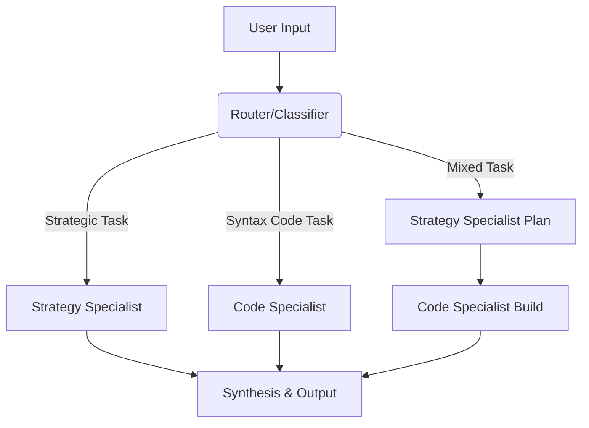

# Phase 2 Experimental Design: Multi-Agent Routing vs. Monolithic Scaffolding

Building upon the findings of Phase 1—which demonstrated that behavioral constitutions are highly portable but prone to **heuristic overfitting** and **context compression limits** when bundled monolithically—Phase 2 shifts from *single-prompt* routing to *multi-agent* orchestration.

---

## 1. Core Hypothesis
A dynamic **Multi-Agent Router** architecture that isolates strategic planning ("Founder Mode") from syntactical code execution ("Coder Mode") will systematically outperform monolithic system prompts. 

Specifically, this architecture will:
1. **Eliminate Heuristic Overfitting**: Prevent strategic logic from leaking into simple codebase maintenance tasks.
2. **Improve Token Efficiency**: Reduce prompt overhead per agent invocation by scoping directives to active sub-tasks.
3. **Elevate Adherence and Quality**: Achieve higher benchmark scores by running specialized agents under isolated, hyper-focused constitutions.

---

## 2. Experimental Variables & Configurations

We will evaluate three primary system configurations across identical workloads:

| Configuration | Architecture | Constitutional Scaffolding |
| :--- | :--- | :--- |
| **Setup A: The Generalist Control** | Monolithic Prompt | Standard baseline developer guidelines (similar to Phase 1 `control`). |
| **Setup B: The Monolithic Strategist** | Monolithic Prompt | The merged Phase 1 `fable-prompted-innovating` (combining Founder Mode and strict syntax guidelines). |
| **Setup C: The Multi-Agent Router** | Orchestration Router | A lightweight router that classifies the task type and delegates it to a specialized subagent (Strategy Specialist vs. Code Specialist). |

### Setup C Specialists
* **The Coordinator/Router**: A fast, low-overhead agent that reads user instructions and outputs routing decisions (`[STRATEGY]`, `[CODE]`, or `[MIXED]`).
* **Strategy Specialist ("Founder Mode")**: Loaded with the full suite of strategic business analysis, contrarian frameworks, and opportunity-hunting constraints.
* **Code Specialist ("Coder Mode")**: Scaffolding with zero business logic directives, focusing entirely on clean syntax, type safety, negative formatting rules, and execution constraints.

---

## 3. Evaluation Tasks (The Benchmark Suite)

Phase 2 will run the configurations against a expanded **30-Task Suite** containing:
1. **10 Pure Strategy & Architecture Queries**: Strategic product definitions, system scaling proposals, and market positioning.
2. **10 Pure Syntactical Coding Tasks**: CSS debugging, React component state fixes, API schema definitions.
3. **10 Mixed-Domain Tasks (The Integration Test)**: Tasks requiring a high-level system architectural plan followed immediately by code scaffolding.

---

## 4. Primary Metrics

Each run will be evaluated quantitatively across four core dimensions:

1. **Task Adherence Score (1–100)**
   * *Metric*: Graded by an automated LLM-as-a-Judge alongside manual developer audits on helpfulness, precision, and adherence to negative constraints.
2. **Heuristic Overfitting Rate (%)**
   * *Metric*: The frequency of "strategic leakage" (e.g., an agent outputting business leverage analysis or contrarian matrices when asked to write a simple React button click handler).
3. **Execution Token Footprint**
   * *Metric*: Total input and output token count processed per completed task.
4. **Compile & Run Correctness (%)**
   * *Metric*: Rate of code outputs compiling and running without syntax or environment errors.

---

## 5. Experimental Procedure

1. **Environment Setup**: Initialize the testing workspace under `experiment/phase_2/`.
2. **Baseline Collection**: Execute Setup A (Control) and Setup B (Monolithic Strategist) across the 30-task suite and log outputs.
3. **Router Implementation**: Deploy the lightweight orchestrator and Specialist subagents (Setup C).
4. **Suite Execution**: Execute Setup C across the same tasks, capturing token metrics, response times, and output files.
5. **Grading Phase**: Run the automated grading harness on the compiled outputs.
6. **Analysis & Report**: Compare the three configurations and publish the findings to `reports/7_Phase_2_Orchestration_Analysis.md`.
