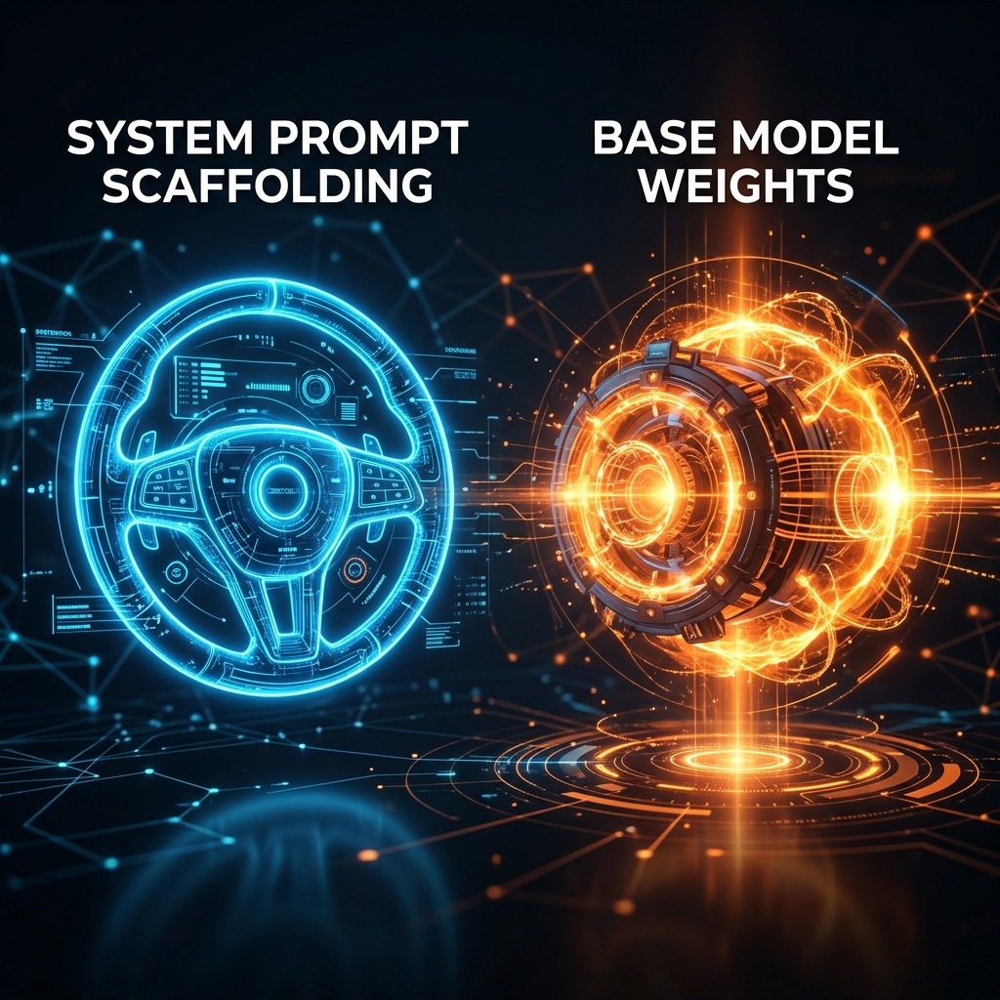
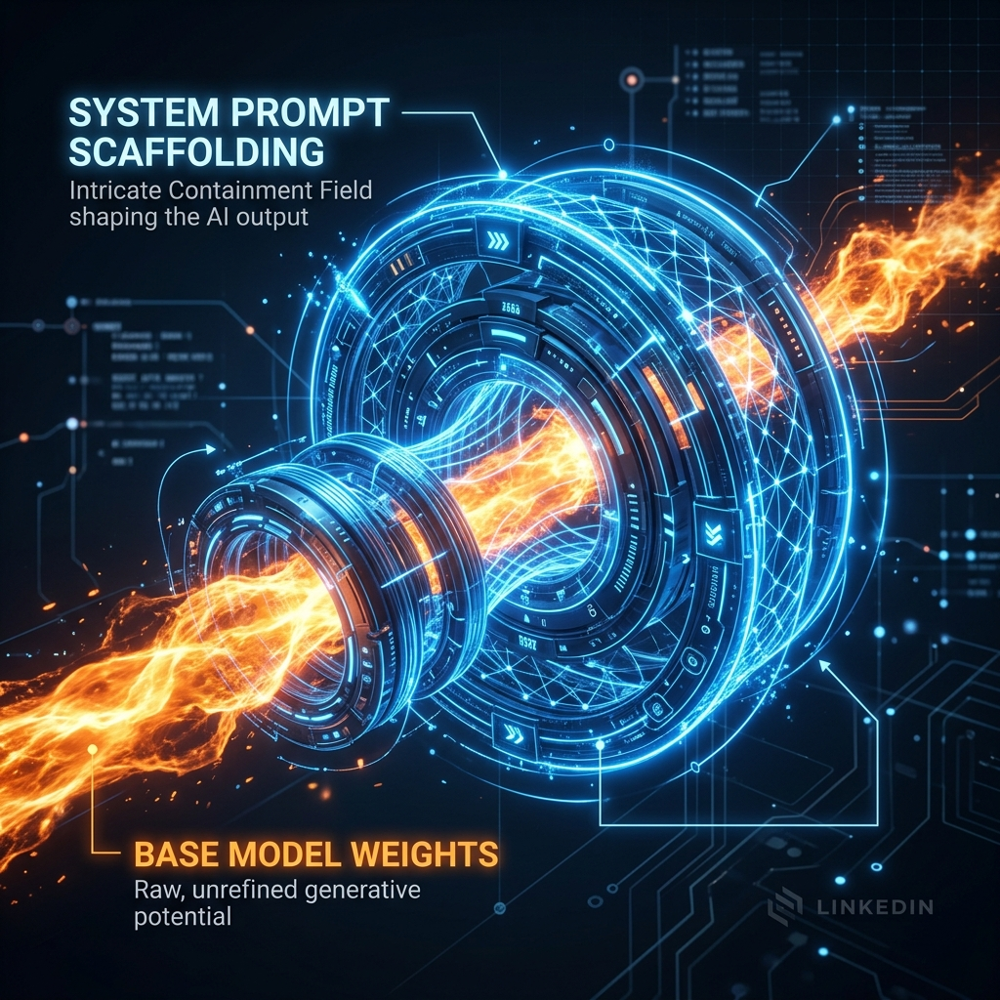
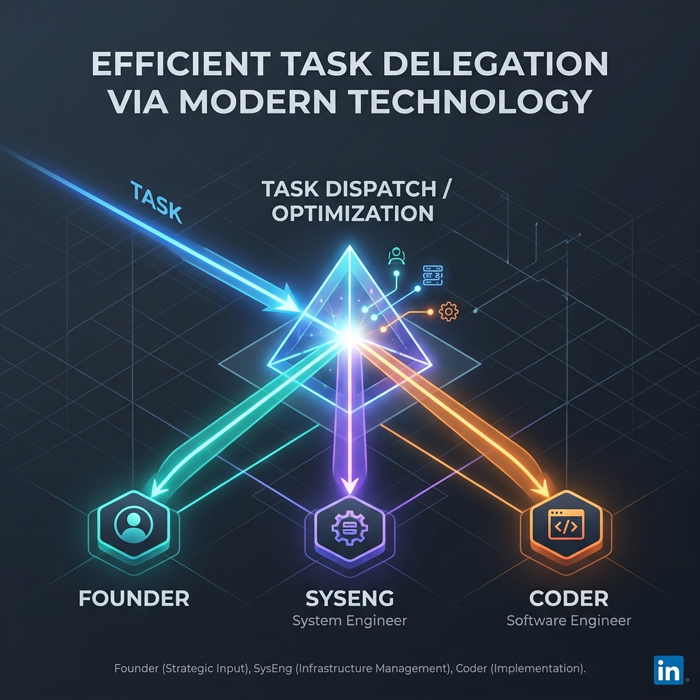
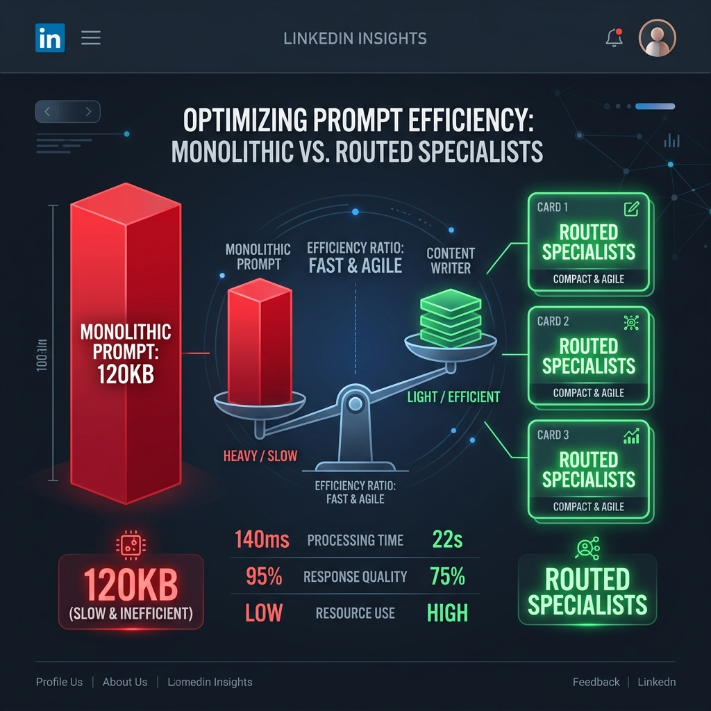

# LinkedIn Research Announcement Thumbnails

This folder contains visual concepts engineered to accompany announcements for the **Antigravity** System Prompt Portability & Routing research.

---

## 1. Idea 1: Steering Wheel vs. Engine (Prompt Portability Limits - Classic Metaphor)
* **Concept**: Visualizes the research finding that system prompt directives steer styles, reasoning layouts, and formatting constraints (the steering wheel), but the core coding/reasoning capability limits converge back to the base model weights (the engine).
* **Image**:
  
* **File Link**: [steering_wheel_engine.jpg](file:///Users/jonathankalsky/Developer/F4b13-5-4-Antigravity/thumbnails/steering_wheel_engine.jpg)

---

## 2. Idea 2: Electromagnetic Field Confinement (Prompt Portability Limits - Scientific Metaphor)
* **Concept**: Refines Idea 1 by using an abstract scientific metaphor: system prompt scaffolding acts as an electromagnetic containment ring steering and confining a raw plasma energy stream (the base model weights).
* **Image**:
  
* **File Link**: [magnetic_plasma_steer.jpg](file:///Users/jonathankalsky/Developer/F4b13-5-4-Antigravity/thumbnails/magnetic_plasma_steer.jpg)

---

## 3. Idea 3: The Alignment Lens (Prompt Portability Limits - Focus Metaphor)
* **Concept**: Refines Idea 1 by using an optical lens metaphor: system prompt scaffolding acts as a precise blue holographic prism lens refracting and focusing a broad stream of raw unstructured capability/knowledge (the base model weights) into a sharp, precise target output focal point.
* **Image**:
  
* **File Link**: [alignment_lens_focus.jpg](file:///Users/jonathankalsky/Developer/F4b13-5-4-Antigravity/thumbnails/alignment_lens_focus.jpg)

---

## 4. Idea 4: Efficient Task Delegation (Prism Router)
* **Concept**: Visualizes the Cognitive Routing mechanism where a task enters a router/coordinator and is split into specialized subagent prompts (Founder, Systems Engineer, Coder).
* **Image**:
  
* **File Link**: [multi_agent_router.jpg](file:///Users/jonathankalsky/Developer/F4b13-5-4-Antigravity/thumbnails/multi_agent_router.jpg)

---

## 5. Idea 5: Context Scoping & Prefill Optimization (Infographic Scale)
* **Concept**: Contrasts the massive prefill payload size of a Monolithic Prompt (120KB) against the lightweight, highly scoped templates of Routed Specialists on a balance scale.
* **Image**:
  
* **File Link**: [context_scoping_cards.jpg](file:///Users/jonathankalsky/Developer/F4b13-5-4-Antigravity/thumbnails/context_scoping_cards.jpg)
